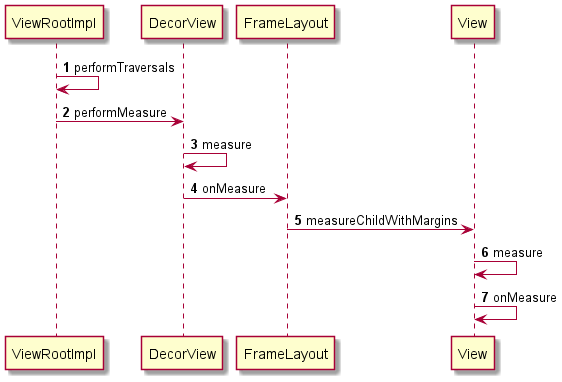

# View 的一些问题

## measure



### ViewRootIml调用  `performMeasure()`的条件

* 第一次渲染
* 窗口、内容inset、Decorview宽高、Configuration发生了变化
* 窗口未处于通知状态 或者 需要强制继续绘制

```java
if (mFirst ||                  // 第一次渲染
    windowShouldResize ||      // 窗口发生了变化
    viewVisibilityChanged ||   // DecorView可见性发生了变化
    cutoutChanged ||           // Inset的区域发生了变化
    params != null ||          // 如果mWindowAttributes不为空
    mForceNextWindowRelayout) {// 整个ViewRoot的Configuration发生了变化，比如横竖屏切换，资源主题的切换
    ......
    if (!mStopped ||           // 窗口未处于通知状态
        mReportNextDraw) {     // 需要强制继续绘制
    	if (focusChangedDueToTouchMode ||        // 以后触点模式发生了变化导致焦点变化
            mWidth != host.getMeasuredWidth() ||  // 宽高发生了变化
            mHeight != host.getMeasuredHeight() || 
            dispatchApplyInsets ||                // 内容区域的inset发生了变化
            updatedConfiguration) {               // Configuration更新
        	......
            performMeasure(childWidthMeasureSpec, childHeightMeasureSpec);
        }
    }
}
```


## layout

### ViewRootIml调用  `performLayout()`的条件

* 此前调用了 `performMeasure()`
* 窗口未处于通知状态 或者 需要强制继续绘制

```java
	   final boolean didLayout = layoutRequested && (!mStopped || mReportNextDraw);
        if (didLayout) {
            // 1、layout
            performLayout(lp, mWidth, mHeight);
            ......
        }
```

