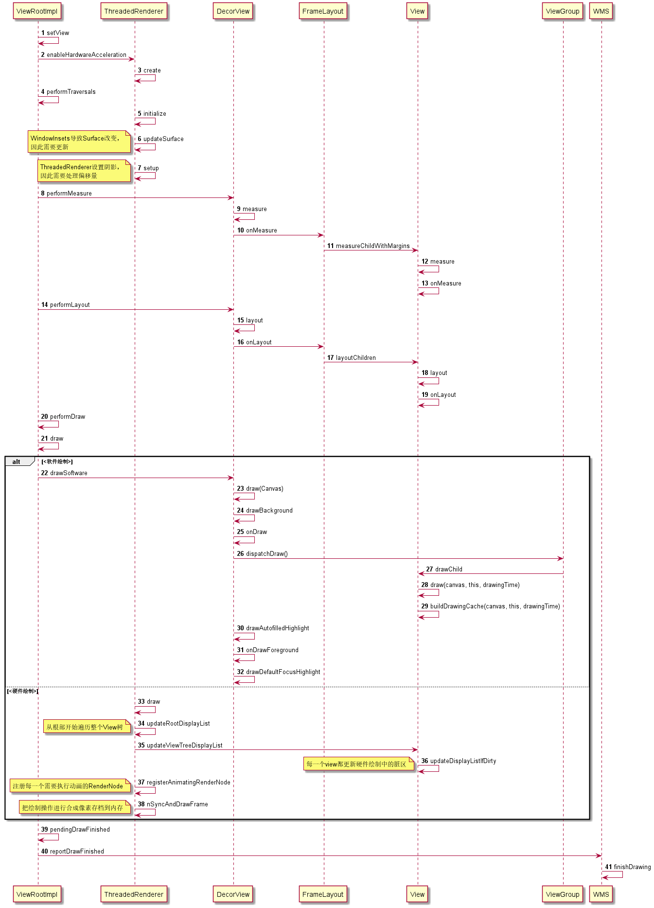

# View的draw




## ViewRootImpl

### `performTraversals()`


```java
	   // 第一次绘制时调用reportNextDraw()，为了把mReportNextDraw置为true，
	   // 保证不影响以后的measure和layout
	   if ((relayoutResult & WindowManagerGlobal.RELAYOUT_RES_FIRST_TIME) != 0) {
            reportNextDraw();
        }
        if ((relayoutResult & WindowManagerGlobal.RELAYOUT_RES_BLAST_SYNC) != 0) {
            reportNextDraw();
            setUseBLASTSyncTransaction();
            mSendNextFrameToWm = true;
        }

        boolean cancelDraw = mAttachInfo.mTreeObserver.dispatchOnPreDraw() || !isViewVisible;

        if (!cancelDraw) {
            if (mPendingTransitions != null && mPendingTransitions.size() > 0) {
                for (int i = 0; i < mPendingTransitions.size(); ++i) {
                    mPendingTransitions.get(i).startChangingAnimations();
                }
                mPendingTransitions.clear();
            }

            /**
             * 真正开始 draw
             */
            performDraw();
        } else {
            if (isViewVisible) {
                // Try again
                scheduleTraversals();
            } else if (mPendingTransitions != null && mPendingTransitions.size() > 0) {
                for (int i = 0; i < mPendingTransitions.size(); ++i) {
                    mPendingTransitions.get(i).endChangingAnimations();
                }
                mPendingTransitions.clear();
            }
        }
```


### `performDraw()`


```java
    private void performDraw() {
        if (mAttachInfo.mDisplayState == Display.STATE_OFF && !mReportNextDraw) {
            return;
        } else if (mView == null) {
            return;
        }

        final boolean fullRedrawNeeded = mFullRedrawNeeded || mReportNextDraw;
        mFullRedrawNeeded = false;

        mIsDrawing = true;
        Trace.traceBegin(Trace.TRACE_TAG_VIEW, "draw");

        boolean usingAsyncReport = false;
        boolean reportNextDraw = mReportNextDraw; // Capture the original value
        
        // 硬件渲染的情况下，需要监听mThreadedRenderer的setFrameCompleteCallback回调执行pendingDrawFinished方法
        if (mAttachInfo.mThreadedRenderer != null && mAttachInfo.mThreadedRenderer.isEnabled()) {
            ArrayList<Runnable> commitCallbacks = mAttachInfo.mTreeObserver
                    .captureFrameCommitCallbacks();
            final boolean needFrameCompleteCallback = mNextDrawUseBLASTSyncTransaction ||
                (commitCallbacks != null && commitCallbacks.size() > 0) ||
                mReportNextDraw;
            usingAsyncReport = mReportNextDraw;
            if (needFrameCompleteCallback) {
                final Handler handler = mAttachInfo.mHandler;
                mAttachInfo.mThreadedRenderer.setFrameCompleteCallback((long frameNr) -> {
                        finishBLASTSync(!mSendNextFrameToWm);
                        handler.postAtFrontOfQueue(() -> {
                            if (reportNextDraw) {
                                // TODO: Use the frame number
                                pendingDrawFinished();
                            }
                            if (commitCallbacks != null) {
                                for (int i = 0; i < commitCallbacks.size(); i++) {
                                    commitCallbacks.get(i).run();
                                }
                            }
                        });});
            }
        }

        try {
            if (mNextDrawUseBLASTSyncTransaction) {
                // TODO(b/149747443)
                // We aren't prepared to handle overlapping use of mRtBLASTSyncTransaction
                // so if we are BLAST syncing we make sure the previous draw has
                // totally finished.
                if (mAttachInfo.mThreadedRenderer != null) {
                    mAttachInfo.mThreadedRenderer.pause();
                }

                mNextReportConsumeBLAST = true;
                mNextDrawUseBLASTSyncTransaction = false;

                if (mBlastBufferQueue != null) {
                    mBlastBufferQueue.setNextTransaction(mRtBLASTSyncTransaction);
                }
            }
            /**
             * 调用draw()去遍历View的
             */
            boolean canUseAsync = draw(fullRedrawNeeded);
            if (usingAsyncReport && !canUseAsync) {
                mAttachInfo.mThreadedRenderer.setFrameCompleteCallback(null);
                usingAsyncReport = false;
                finishBLASTSync(true /* apply */);
            }
        } finally {
            mIsDrawing = false;
            Trace.traceEnd(Trace.TRACE_TAG_VIEW);
        }

        // For whatever reason we didn't create a HardwareRenderer, end any
        // hardware animations that are now dangling
        if (mAttachInfo.mPendingAnimatingRenderNodes != null) {
            final int count = mAttachInfo.mPendingAnimatingRenderNodes.size();
            for (int i = 0; i < count; i++) {
                mAttachInfo.mPendingAnimatingRenderNodes.get(i).endAllAnimators();
            }
            mAttachInfo.mPendingAnimatingRenderNodes.clear();
        }

        if (mReportNextDraw) {
            mReportNextDraw = false;

            // if we're using multi-thread renderer, wait for the window frame draws
            if (mWindowDrawCountDown != null) {
                try {
                    mWindowDrawCountDown.await();
                } catch (InterruptedException e) {
                    Log.e(mTag, "Window redraw count down interrupted!");
                }
                mWindowDrawCountDown = null;
            }

            if (mAttachInfo.mThreadedRenderer != null) {
                mAttachInfo.mThreadedRenderer.setStopped(mStopped);
            }

            if (mSurfaceHolder != null && mSurface.isValid()) {
                SurfaceCallbackHelper sch = new SurfaceCallbackHelper(this::postDrawFinished);
                SurfaceHolder.Callback callbacks[] = mSurfaceHolder.getCallbacks();

                sch.dispatchSurfaceRedrawNeededAsync(mSurfaceHolder, callbacks);
            } else if (!usingAsyncReport) {
                if (mAttachInfo.mThreadedRenderer != null) {
                    mAttachInfo.mThreadedRenderer.fence();
                }
                pendingDrawFinished();
            }
        }
        if (mPerformContentCapture) {
            performContentCaptureInitialReport();
        }
    }

```


### `draw()`


```java
    private boolean draw(boolean fullRedrawNeeded) {
        Surface surface = mSurface;
        // surface无效则直接返回
        if (!surface.isValid()) {
            return false;
        }

        if (!sFirstDrawComplete) {
            synchronized (sFirstDrawHandlers) {
                sFirstDrawComplete = true;
                final int count = sFirstDrawHandlers.size();
                for (int i = 0; i< count; i++) {
                    mHandler.post(sFirstDrawHandlers.get(i));
                }
            }
        }

        /**
         * 处理滑动区域或者焦点区域,如果滑动了就dispatchOnScrollChanged
         */
        scrollToRectOrFocus(null, false);

        if (mAttachInfo.mViewScrollChanged) {
            mAttachInfo.mViewScrollChanged = false;
            mAttachInfo.mTreeObserver.dispatchOnScrollChanged();
        }

        boolean animating = mScroller != null && mScroller.computeScrollOffset();
        final int curScrollY;
        if (animating) {
            curScrollY = mScroller.getCurrY();
        } else {
            curScrollY = mScrollY;
        }
        if (mCurScrollY != curScrollY) {
            mCurScrollY = curScrollY;
            fullRedrawNeeded = true;
            if (mView instanceof RootViewSurfaceTaker) {
                ((RootViewSurfaceTaker) mView).onRootViewScrollYChanged(mCurScrollY);
            }
        }

        final float appScale = mAttachInfo.mApplicationScale;
        final boolean scalingRequired = mAttachInfo.mScalingRequired;

        final Rect dirty = mDirty;
        if (mSurfaceHolder != null) {
            // The app owns the surface, we won't draw.
            dirty.setEmpty();
            if (animating && mScroller != null) {
                mScroller.abortAnimation();
            }
            return false;
        }

        if (fullRedrawNeeded) {
            dirty.set(0, 0, (int) (mWidth * appScale + 0.5f), (int) (mHeight * appScale + 0.5f));
        }
        /**
         * 开始从 DecorView 分发 draw
         */
        mAttachInfo.mTreeObserver.dispatchOnDraw();

        /**
         * 绘制前根据偏移量更新一下 脏区
         */
        int xOffset = -mCanvasOffsetX;
        int yOffset = -mCanvasOffsetY + curScrollY;
        final WindowManager.LayoutParams params = mWindowAttributes;
        final Rect surfaceInsets = params != null ? params.surfaceInsets : null;
        if (surfaceInsets != null) {
            xOffset -= surfaceInsets.left;
            yOffset -= surfaceInsets.top;

            // Offset dirty rect for surface insets.
            dirty.offset(surfaceInsets.left, surfaceInsets.right);
        }

        boolean accessibilityFocusDirty = false;
        final Drawable drawable = mAttachInfo.mAccessibilityFocusDrawable;
        if (drawable != null) {
            final Rect bounds = mAttachInfo.mTmpInvalRect;
            final boolean hasFocus = getAccessibilityFocusedRect(bounds);
            if (!hasFocus) {
                bounds.setEmpty();
            }
            if (!bounds.equals(drawable.getBounds())) {
                accessibilityFocusDirty = true;
            }
        }

        mAttachInfo.mDrawingTime =
                mChoreographer.getFrameTimeNanos() / TimeUtils.NANOS_PER_MS;

        /**
         * 如果 脏区不为null 或者 正在执行动画 或者 无障碍服务发生变化
         * 就开始 进行渲染 (硬件渲染 或者 软件渲染)
         */
        boolean useAsyncReport = false;
        if (!dirty.isEmpty() || mIsAnimating || accessibilityFocusDirty) {
            /**
             * 默认进行硬件渲染
             */
            if (mAttachInfo.mThreadedRenderer != null && mAttachInfo.mThreadedRenderer.isEnabled()) {
                // If accessibility focus moved, always invalidate the root.
                boolean invalidateRoot = accessibilityFocusDirty || mInvalidateRootRequested;
                mInvalidateRootRequested = false;

                // Draw with hardware renderer.
                mIsAnimating = false;

                /**
                 * 如果硬件绘制区域发生变化，就进行硬件绘制
                 */
                if (mHardwareYOffset != yOffset || mHardwareXOffset != xOffset) {
                    mHardwareYOffset = yOffset;
                    mHardwareXOffset = xOffset;
                    invalidateRoot = true;
                }

                if (invalidateRoot) {
                    mAttachInfo.mThreadedRenderer.invalidateRoot();
                }

                dirty.setEmpty();

                // Stage the content drawn size now. It will be transferred to the renderer
                // shortly before the draw commands get send to the renderer.
                final boolean updated = updateContentDrawBounds();

                if (mReportNextDraw) {
                    // report next draw overrides setStopped()
                    // This value is re-sync'd to the value of mStopped
                    // in the handling of mReportNextDraw post-draw.
                    mAttachInfo.mThreadedRenderer.setStopped(false);
                }

                if (updated) {
                    requestDrawWindow();
                }

                useAsyncReport = true;

                /**
                 * 进行硬件绘制
                 */
                mAttachInfo.mThreadedRenderer.draw(mView, mAttachInfo, this);
            } else {
                // If we get here with a disabled & requested hardware renderer, something went
                // wrong (an invalidate posted right before we destroyed the hardware surface
                // for instance) so we should just bail out. Locking the surface with software
                // rendering at this point would lock it forever and prevent hardware renderer
                // from doing its job when it comes back.
                // Before we request a new frame we must however attempt to reinitiliaze the
                // hardware renderer if it's in requested state. This would happen after an
                // eglTerminate() for instance.
                if (mAttachInfo.mThreadedRenderer != null &&
                        !mAttachInfo.mThreadedRenderer.isEnabled() &&
                        mAttachInfo.mThreadedRenderer.isRequested() &&
                        mSurface.isValid()) {

                    try {
                        mAttachInfo.mThreadedRenderer.initializeIfNeeded(
                                mWidth, mHeight, mAttachInfo, mSurface, surfaceInsets);
                    } catch (OutOfResourcesException e) {
                        handleOutOfResourcesException(e);
                        return false;
                    }

                    mFullRedrawNeeded = true;
                    scheduleTraversals();
                    return false;
                }

                /**
                 * 调用 drawSoftware() 进行软件渲染
                 */
                if (!drawSoftware(surface, mAttachInfo, xOffset, yOffset,
                        scalingRequired, dirty, surfaceInsets)) {
                    return false;
                }
            }
        }

        if (animating) {
            mFullRedrawNeeded = true;
            scheduleTraversals();
        }
        return useAsyncReport;
    }

```

#  ------------

# 软件绘制

## ViewRootImpl

### `drawSoftware()`

1. 根据全局的surface的偏移量对整个dirty区域进行偏移

2. 通过Surface.lockCanvas方法映射一个Canvas对象，之后所有的绘制行为都在这个Canvas对象上。

3. 获得Canvas后，由于上面是对整个surface的偏移，因此Canvas作为surface映射出来的绘制对象也需要进行一次偏移。

4. 调用 `DecorView.draw()`，开始对整个View树遍历。

5. 遍历完整个View树后，说明所有的信息已经会知道Canvas了，就可以通过surface.unlockCanvasAndPost，把记录在SkCanvas中的像素数据发送到SF中渲染到屏幕中。

```java
    private boolean drawSoftware(Surface surface, AttachInfo attachInfo, int xoff, int yoff,
            boolean scalingRequired, Rect dirty, Rect surfaceInsets) {

        // Draw with software renderer.
        final Canvas canvas;

        /**
         * 根据全局的surface的偏移量对整个dirty区域进行偏移
         */
        int dirtyXOffset = xoff;
        int dirtyYOffset = yoff;
        if (surfaceInsets != null) {
            dirtyXOffset += surfaceInsets.left;
            dirtyYOffset += surfaceInsets.top;
        }

        try {
            dirty.offset(-dirtyXOffset, -dirtyYOffset);
            final int left = dirty.left;
            final int top = dirty.top;
            final int right = dirty.right;
            final int bottom = dirty.bottom;

            canvas = mSurface.lockCanvas(dirty);

            // TODO: Do this in native
            canvas.setDensity(mDensity);
        } finally {
            /**
             * 对整个dirty区域进行偏移
             */
            dirty.offset(dirtyXOffset, dirtyYOffset);  // Reset to the original value.
        }

        try {
            
            if (!canvas.isOpaque() || yoff != 0 || xoff != 0) {
                canvas.drawColor(0, PorterDuff.Mode.CLEAR);
            }

            dirty.setEmpty();
            mIsAnimating = false;
            mView.mPrivateFlags |= View.PFLAG_DRAWN;
            
            /**
             * 对 Canvas 进行偏移
             */
            canvas.translate(-xoff, -yoff);
            if (mTranslator != null) {
                mTranslator.translateCanvas(canvas);
            }
            canvas.setScreenDensity(scalingRequired ? mNoncompatDensity : 0);

            /**
             * 开始让 DecorView 开始遍历绘制
             */
            mView.draw(canvas);

            drawAccessibilityFocusedDrawableIfNeeded(canvas);
        } 
        return true;
    }
```


## DecorView

### `draw(Canvas)`

```java
	public void draw(Canvas canvas) {
        // 实际上是调用 View.draw()
        super.draw(canvas);

        if (mMenuBackground != null) {
            mMenuBackground.draw(canvas);
        }
    }
```


## View

### `draw(Canvas)`


```java
    public void draw(Canvas canvas) {
        final int privateFlags = mPrivateFlags;
        mPrivateFlags = (privateFlags & ~PFLAG_DIRTY_MASK) | PFLAG_DRAWN;

        /*
         * Draw traversal performs several drawing steps which must be executed
         * in the appropriate order:
         *
         *      1. drawBackground()绘制背景
         *      2. 如有必要，保存canvas的layer以准备渐变
         *      3. onDraw()绘制内容
         *      4. dispatchDraw()绘制子view
         *      5. 如有必要，绘制渐变边缘并恢复layer
         *      6. 绘制装饰（例如前景、滚动条）
         *      7. 如有必要，绘制默认焦点高亮
         */

        // Step 1, draw the background, if needed
        int saveCount;
        drawBackground(canvas);

        // skip step 2 & 5 if possible (common case)
        final int viewFlags = mViewFlags;
        boolean horizontalEdges = (viewFlags & FADING_EDGE_HORIZONTAL) != 0;
        boolean verticalEdges = (viewFlags & FADING_EDGE_VERTICAL) != 0;
        if (!verticalEdges && !horizontalEdges) {
            // Step 3, draw the content
            onDraw(canvas);

            // Step 4, draw the children
            dispatchDraw(canvas);

            drawAutofilledHighlight(canvas);

            // Overlay is part of the content and draws beneath Foreground
            if (mOverlay != null && !mOverlay.isEmpty()) {
                mOverlay.getOverlayView().dispatchDraw(canvas);
            }

            // Step 6, draw decorations (foreground, scrollbars)
            onDrawForeground(canvas);

            // Step 7, draw the default focus highlight
            drawDefaultFocusHighlight(canvas);

            if (isShowingLayoutBounds()) {
                debugDrawFocus(canvas);
            }

            // we're done...
            return;
        }

        /*
         * Here we do the full fledged routine...
         * (this is an uncommon case where speed matters less,
         * this is why we repeat some of the tests that have been
         * done above)
         */

        boolean drawTop = false;
        boolean drawBottom = false;
        boolean drawLeft = false;
        boolean drawRight = false;

        float topFadeStrength = 0.0f;
        float bottomFadeStrength = 0.0f;
        float leftFadeStrength = 0.0f;
        float rightFadeStrength = 0.0f;

        // Step 2, save the canvas' layers
        int paddingLeft = mPaddingLeft;

        final boolean offsetRequired = isPaddingOffsetRequired();
        if (offsetRequired) {
            paddingLeft += getLeftPaddingOffset();
        }

        int left = mScrollX + paddingLeft;
        int right = left + mRight - mLeft - mPaddingRight - paddingLeft;
        int top = mScrollY + getFadeTop(offsetRequired);
        int bottom = top + getFadeHeight(offsetRequired);

        if (offsetRequired) {
            right += getRightPaddingOffset();
            bottom += getBottomPaddingOffset();
        }

        final ScrollabilityCache scrollabilityCache = mScrollCache;
        final float fadeHeight = scrollabilityCache.fadingEdgeLength;
        int length = (int) fadeHeight;

        // clip the fade length if top and bottom fades overlap
        // overlapping fades produce odd-looking artifacts
        if (verticalEdges && (top + length > bottom - length)) {
            length = (bottom - top) / 2;
        }

        // also clip horizontal fades if necessary
        if (horizontalEdges && (left + length > right - length)) {
            length = (right - left) / 2;
        }

        if (verticalEdges) {
            topFadeStrength = Math.max(0.0f, Math.min(1.0f, getTopFadingEdgeStrength()));
            drawTop = topFadeStrength * fadeHeight > 1.0f;
            bottomFadeStrength = Math.max(0.0f, Math.min(1.0f, getBottomFadingEdgeStrength()));
            drawBottom = bottomFadeStrength * fadeHeight > 1.0f;
        }

        if (horizontalEdges) {
            leftFadeStrength = Math.max(0.0f, Math.min(1.0f, getLeftFadingEdgeStrength()));
            drawLeft = leftFadeStrength * fadeHeight > 1.0f;
            rightFadeStrength = Math.max(0.0f, Math.min(1.0f, getRightFadingEdgeStrength()));
            drawRight = rightFadeStrength * fadeHeight > 1.0f;
        }

        saveCount = canvas.getSaveCount();
        int topSaveCount = -1;
        int bottomSaveCount = -1;
        int leftSaveCount = -1;
        int rightSaveCount = -1;

        int solidColor = getSolidColor();
        if (solidColor == 0) {
            if (drawTop) {
                topSaveCount = canvas.saveUnclippedLayer(left, top, right, top + length);
            }

            if (drawBottom) {
                bottomSaveCount = canvas.saveUnclippedLayer(left, bottom - length, right, bottom);
            }

            if (drawLeft) {
                leftSaveCount = canvas.saveUnclippedLayer(left, top, left + length, bottom);
            }

            if (drawRight) {
                rightSaveCount = canvas.saveUnclippedLayer(right - length, top, right, bottom);
            }
        } else {
            scrollabilityCache.setFadeColor(solidColor);
        }

        // Step 3, draw the content
        onDraw(canvas);

        // Step 4, draw the children
        dispatchDraw(canvas);

        // Step 5, draw the fade effect and restore layers
        final Paint p = scrollabilityCache.paint;
        final Matrix matrix = scrollabilityCache.matrix;
        final Shader fade = scrollabilityCache.shader;

        // must be restored in the reverse order that they were saved
        if (drawRight) {
            matrix.setScale(1, fadeHeight * rightFadeStrength);
            matrix.postRotate(90);
            matrix.postTranslate(right, top);
            fade.setLocalMatrix(matrix);
            p.setShader(fade);
            if (solidColor == 0) {
                canvas.restoreUnclippedLayer(rightSaveCount, p);

            } else {
                canvas.drawRect(right - length, top, right, bottom, p);
            }
        }

        if (drawLeft) {
            matrix.setScale(1, fadeHeight * leftFadeStrength);
            matrix.postRotate(-90);
            matrix.postTranslate(left, top);
            fade.setLocalMatrix(matrix);
            p.setShader(fade);
            if (solidColor == 0) {
                canvas.restoreUnclippedLayer(leftSaveCount, p);
            } else {
                canvas.drawRect(left, top, left + length, bottom, p);
            }
        }

        if (drawBottom) {
            matrix.setScale(1, fadeHeight * bottomFadeStrength);
            matrix.postRotate(180);
            matrix.postTranslate(left, bottom);
            fade.setLocalMatrix(matrix);
            p.setShader(fade);
            if (solidColor == 0) {
                canvas.restoreUnclippedLayer(bottomSaveCount, p);
            } else {
                canvas.drawRect(left, bottom - length, right, bottom, p);
            }
        }

        if (drawTop) {
            matrix.setScale(1, fadeHeight * topFadeStrength);
            matrix.postTranslate(left, top);
            fade.setLocalMatrix(matrix);
            p.setShader(fade);
            if (solidColor == 0) {
                canvas.restoreUnclippedLayer(topSaveCount, p);
            } else {
                canvas.drawRect(left, top, right, top + length, p);
            }
        }

        canvas.restoreToCount(saveCount);

        drawAutofilledHighlight(canvas);

        // Overlay is part of the content and draws beneath Foreground
        if (mOverlay != null && !mOverlay.isEmpty()) {
            mOverlay.getOverlayView().dispatchDraw(canvas);
        }

        // Step 6, draw decorations (foreground, scrollbars)
        onDrawForeground(canvas);

        // Step 7, draw the default focus highlight
        drawDefaultFocusHighlight(canvas);

        if (isShowingLayoutBounds()) {
            debugDrawFocus(canvas);
        }
    }

```


### `drawBackground()`

```java
    private void drawBackground(Canvas canvas) {
        final Drawable background = mBackground;
        if (background == null) {
            return;
        }

        setBackgroundBounds();

        // 硬件绘制：
        // 首先会通过getDrawableRenderNode方法获取一个drawable渲染的renderNode，
        // 接着调用canvas的drawRenderNode。
        if (canvas.isHardwareAccelerated() && mAttachInfo != null
                && mAttachInfo.mThreadedRenderer != null) {
            mBackgroundRenderNode = getDrawableRenderNode(background, mBackgroundRenderNode);

            final RenderNode renderNode = mBackgroundRenderNode;
            if (renderNode != null && renderNode.hasDisplayList()) {
                setBackgroundRenderNodeProperties(renderNode);
                ((RecordingCanvas) canvas).drawRenderNode(renderNode);
                return;
            }
        }
		
        // 软件绘制：调用draable的draw9)，把像素绘制到上
        final int scrollX = mScrollX;
        final int scrollY = mScrollY;
        if ((scrollX | scrollY) == 0) {
            background.draw(canvas);
        } else {
            canvas.translate(scrollX, scrollY);
            background.draw(canvas);
            canvas.translate(-scrollX, -scrollY);
        }
    }

```


### `onDraw()`

由子View实现


## ViewGroup

### `dispatchDraw()`

```java
    protected void dispatchDraw(Canvas canvas) {
        boolean usingRenderNodeProperties = canvas.isRecordingFor(mRenderNode);
        final int childrenCount = mChildrenCount;
        final View[] children = mChildren;
        int flags = mGroupFlags;

        /**
         * 判断是否打开了FLAG_RUN_ANIMATION标志位，且允许Layout动画。
         * 这个情况下，则会遍历，对可见的子view设置layout动画
         */ 
        if ((flags & FLAG_RUN_ANIMATION) != 0 && canAnimate()) {
            final boolean buildCache = !isHardwareAccelerated();
            for (int i = 0; i < childrenCount; i++) {
                final View child = children[i];
                if ((child.mViewFlags & VISIBILITY_MASK) == VISIBLE) {
                    final LayoutParams params = child.getLayoutParams();
                    attachLayoutAnimationParameters(child, params, i, childrenCount);
                    bindLayoutAnimation(child);
                }
            }

            final LayoutAnimationController controller = mLayoutAnimationController;
            if (controller.willOverlap()) {
                mGroupFlags |= FLAG_OPTIMIZE_INVALIDATE;
            }

            controller.start();

            mGroupFlags &= ~FLAG_RUN_ANIMATION;
            mGroupFlags &= ~FLAG_ANIMATION_DONE;

            if (mAnimationListener != null) {
                mAnimationListener.onAnimationStart(controller.getAnimation());
            }
        }

        /**
         * 判断是否被padding裁剪内容区域，默认是开启的。
         * 这个情况下，则会对滑动的区域，padding区域，以及viewgroup的区域进行裁剪，而不是统统都画到Canvas中。
         */
        int clipSaveCount = 0;
        final boolean clipToPadding = (flags & CLIP_TO_PADDING_MASK) == CLIP_TO_PADDING_MASK;
        if (clipToPadding) {
            clipSaveCount = canvas.save(Canvas.CLIP_SAVE_FLAG);
            canvas.clipRect(mScrollX + mPaddingLeft, mScrollY + mPaddingTop,
                    mScrollX + mRight - mLeft - mPaddingRight,
                    mScrollY + mBottom - mTop - mPaddingBottom);
        }

        // We will draw our child's animation, let's reset the flag
        mPrivateFlags &= ~PFLAG_DRAW_ANIMATION;
        mGroupFlags &= ~FLAG_INVALIDATE_REQUIRED;

        boolean more = false;
        final long drawingTime = getDrawingTime();

        if (usingRenderNodeProperties) canvas.insertReorderBarrier();
        final int transientCount = mTransientIndices == null ? 0 : mTransientIndices.size();
        int transientIndex = transientCount != 0 ? 0 : -1;
        
        /**
         * 判断是否打开了硬件加速。
         * 如果没有，buildOrderedChildList对当前该ViewGroup下所有子View进行z轴上的插入排序
         * 从而决定显示的上下关系。
         */
        final ArrayList<View> preorderedList = usingRenderNodeProperties
                ? null : buildOrderedChildList();
        final boolean customOrder = preorderedList == null
                && isChildrenDrawingOrderEnabled();
        for (int i = 0; i < childrenCount; i++) {
            while (transientIndex >= 0 && mTransientIndices.get(transientIndex) == i) {
                final View transientChild = mTransientViews.get(transientIndex);
                if ((transientChild.mViewFlags & VISIBILITY_MASK) == VISIBLE ||
                        transientChild.getAnimation() != null) {
                    more |= drawChild(canvas, transientChild, drawingTime);
                }
                transientIndex++;
                if (transientIndex >= transientCount) {
                    transientIndex = -1;
                }
            }

            final int childIndex = getAndVerifyPreorderedIndex(childrenCount, i, customOrder);
            final View child = getAndVerifyPreorderedView(preorderedList, children, childIndex);
            if ((child.mViewFlags & VISIBILITY_MASK) == VISIBLE || child.getAnimation() != null) {
                more |= drawChild(canvas, child, drawingTime);
            }
        }
        while (transientIndex >= 0) {
            // there may be additional transient views after the normal views
            final View transientChild = mTransientViews.get(transientIndex);
            if ((transientChild.mViewFlags & VISIBILITY_MASK) == VISIBLE ||
                    transientChild.getAnimation() != null) {
                more |= drawChild(canvas, transientChild, drawingTime);
            }
            transientIndex++;
            if (transientIndex >= transientCount) {
                break;
            }
        }
        if (preorderedList != null) preorderedList.clear();

        // Draw any disappearing views that have animations
        if (mDisappearingChildren != null) {
            final ArrayList<View> disappearingChildren = mDisappearingChildren;
            final int disappearingCount = disappearingChildren.size() - 1;
            // Go backwards -- we may delete as animations finish
            for (int i = disappearingCount; i >= 0; i--) {
                final View child = disappearingChildren.get(i);
                more |= drawChild(canvas, child, drawingTime);
            }
        }
        if (usingRenderNodeProperties) canvas.insertInorderBarrier();

        if (isShowingLayoutBounds()) {
            onDebugDraw(canvas);
        }

        if (clipToPadding) {
            canvas.restoreToCount(clipSaveCount);
        }

        // mGroupFlags might have been updated by drawChild()
        flags = mGroupFlags;

        if ((flags & FLAG_INVALIDATE_REQUIRED) == FLAG_INVALIDATE_REQUIRED) {
            invalidate(true);
        }

        // 如果动画完成就通知所有监听者
        if ((flags & FLAG_ANIMATION_DONE) == 0 && (flags & FLAG_NOTIFY_ANIMATION_LISTENER) == 0 &&
                mLayoutAnimationController.isDone() && !more) {
            // We want to erase the drawing cache and notify the listener after the
            // next frame is drawn because one extra invalidate() is caused by
            // drawChild() after the animation is over
            mGroupFlags |= FLAG_NOTIFY_ANIMATION_LISTENER;
            final Runnable end = new Runnable() {
               @Override
               public void run() {
                   notifyAnimationListener();
               }
            };
            post(end);
        }
    }

```


### `drawChild()`

```java
	protected boolean drawChild(Canvas canvas, View child, long drawingTime) {
        return child.draw(canvas, this, drawingTime);
    }
```


## View

### `draw(Canvas, ViewGroup, long)`

此时只关心软件绘制

* `buildDrawingCache()` 构建一个绘制的缓存bitmap
* `getDrawingCache()` 获取这个缓存bitmap到cache中
* `omputeScroll()` 计算滑动区域
* `Canvas.save()` 保存当前状态
* 因为滑动以及动画的原因，需要对 canvas 执行平移、缩放、渐变、裁剪等操作
* 判断是否有缓存：
  * 没有缓存时，调用 `dispatchDraw()` 或者 `draw(canvas)` 进行绘制。
  * 有缓存时，就调用 `canvas.drawBitmap()` 把 cache 中缓存的bitmap 绘制到 canvas 上
* `canvas.restoreToCount()` 恢复之前保存的状态

```java
    boolean draw(Canvas canvas, ViewGroup parent, long drawingTime) {

        ......
        Bitmap cache = null;
        int layerType = getLayerType(); 
        if (layerType == LAYER_TYPE_SOFTWARE || !drawingWithRenderNode) {
             if (layerType != LAYER_TYPE_NONE) {
                 layerType = LAYER_TYPE_SOFTWARE;
                 // 构建一个绘制的缓存bitmap
                 buildDrawingCache(true);
            }
            // 获取缓存bitmap到cache中
            cache = getDrawingCache(true);
        }

        ......

        int sx = 0;
        int sy = 0;
        // 计算滑动区域
        if (!drawingWithRenderNode) {
            computeScroll();
            sx = mScrollX;
            sy = mScrollY;
        }

        final boolean drawingWithDrawingCache = cache != null && !drawingWithRenderNode;
        final boolean offsetForScroll = cache == null && !drawingWithRenderNode;

        //  保存当前状态
        int restoreTo = -1;
        if (!drawingWithRenderNode || transformToApply != null) {
            restoreTo = canvas.save();
        }
        
        // 因为滑动以及动画的原因，需要对 canvas 执行平移、缩放、渐变、裁剪等操作
        ......
            
        if (!drawingWithDrawingCache) {
            // 没有缓存时，需要进行绘制  
            if (drawingWithRenderNode) {
                mPrivateFlags &= ~PFLAG_DIRTY_MASK;
                ((RecordingCanvas) canvas).drawRenderNode(renderNode);
            } else {
                // 软件绘制情况下，通过标志位 PFLAG_SKIP_DRAW 判断是否需要跳过当前view的绘制
                // 如果跳过，就调用 dispatchDraw() 进行分发让子view绘制
                // 如果不跳过，就调用 draw(Canvas) 进行绘制
                if ((mPrivateFlags & PFLAG_SKIP_DRAW) == PFLAG_SKIP_DRAW) {
                    mPrivateFlags &= ~PFLAG_DIRTY_MASK;
                    dispatchDraw(canvas);
                } else {
                    draw(canvas);
                }
            }
        } else if (cache != null) {
            // 有缓存时，就调用 canvas.drawBitmap() 把 cache 中缓存的bitmap 绘制到 canvas 上
            // ps: 此时没有调用dispatchDraw()或者draw(Canvas)是因为前面buildDrawingCache()已经执行了
            mPrivateFlags &= ~PFLAG_DIRTY_MASK;
            if (layerType == LAYER_TYPE_NONE || mLayerPaint == null) {
                // no layer paint, use temporary paint to draw bitmap
                Paint cachePaint = parent.mCachePaint;
                if (cachePaint == null) {
                    cachePaint = new Paint();
                    cachePaint.setDither(false);
                    parent.mCachePaint = cachePaint;
                }
                cachePaint.setAlpha((int) (alpha * 255));
                canvas.drawBitmap(cache, 0.0f, 0.0f, cachePaint);
            } else {
                // use layer paint to draw the bitmap, merging the two alphas, but also restore
                int layerPaintAlpha = mLayerPaint.getAlpha();
                if (alpha < 1) {
                    mLayerPaint.setAlpha((int) (alpha * layerPaintAlpha));
                }
                canvas.drawBitmap(cache, 0.0f, 0.0f, mLayerPaint);
                if (alpha < 1) {
                    mLayerPaint.setAlpha(layerPaintAlpha);
                }
            }
        }

        // 恢复canvas 之前保存的状态
        if (restoreTo >= 0) {
            canvas.restoreToCount(restoreTo);
        }

        if (a != null && !more) {
            if (!hardwareAcceleratedCanvas && !a.getFillAfter()) {
                onSetAlpha(255);
            }
            parent.finishAnimatingView(this, a);
        }

        if (more && hardwareAcceleratedCanvas) {
            if (a.hasAlpha() && (mPrivateFlags & PFLAG_ALPHA_SET) == PFLAG_ALPHA_SET) {
                // alpha animations should cause the child to recreate its display list
                invalidate(true);
            }
        }

        mRecreateDisplayList = false;

        return more;
    }


### `buildDrawingCache()`

* 如果当前View的宽高其中之一小于等于0，或者当前View需要内存大于最大允许的缓存View大小。就会销毁缓存并返回
* 如果view的大小发生了变化，就调用 Bitmap.createBitmap() 创建同样大小的 bitmap cache 
* 把 bitmap 设置到 canvas
* 对 canvas 进行需要的缩放以及平移

​```java
    public void buildDrawingCache(boolean autoScale) {
        if ((mPrivateFlags & PFLAG_DRAWING_CACHE_VALID) == 0 || (autoScale ?
                mDrawingCache == null : mUnscaledDrawingCache == null)) {
            buildDrawingCacheImpl(autoScale);
        }
    }

	private void buildDrawingCacheImpl(boolean autoScale) {
        mCachingFailed = false;

        int width = mRight - mLeft;
        int height = mBottom - mTop;

        final AttachInfo attachInfo = mAttachInfo;
        final boolean scalingRequired = attachInfo != null && attachInfo.mScalingRequired;

        if (autoScale && scalingRequired) {
            width = (int) ((width * attachInfo.mApplicationScale) + 0.5f);
            height = (int) ((height * attachInfo.mApplicationScale) + 0.5f);
        }

        final int drawingCacheBackgroundColor = mDrawingCacheBackgroundColor;
        final boolean opaque = drawingCacheBackgroundColor != 0 || isOpaque();
        final boolean use32BitCache = attachInfo != null && attachInfo.mUse32BitDrawingCache;

        final long projectedBitmapSize = width * height * (opaque && !use32BitCache ? 2 : 4);
        final long drawingCacheSize =
                ViewConfiguration.get(mContext).getScaledMaximumDrawingCacheSize();
        
        // 如果当前View的宽高其中之一小于等于0，或者当前View需要内存大于最大允许的缓存View大小。
        // 就会销毁缓存并返回
        if (width <= 0 || height <= 0 || projectedBitmapSize > drawingCacheSize) {
            if (width > 0 && height > 0) {
                Log.w(VIEW_LOG_TAG, getClass().getSimpleName() + " not displayed because it is"
                        + " too large to fit into a software layer (or drawing cache), needs "
                        + projectedBitmapSize + " bytes, only "
                        + drawingCacheSize + " available");
            }
            destroyDrawingCache();
            mCachingFailed = true;
            return;
        }

        boolean clear = true;
        Bitmap bitmap = autoScale ? mDrawingCache : mUnscaledDrawingCache;
		
        // 如果view的大小发生了变化，就调用 Bitmap.createBitmap() 创建同样大小的 bitmap
        if (bitmap == null || bitmap.getWidth() != width || bitmap.getHeight() != height) {
            Bitmap.Config quality;
            if (!opaque) {
                // Never pick ARGB_4444 because it looks awful
                // Keep the DRAWING_CACHE_QUALITY_LOW flag just in case
                switch (mViewFlags & DRAWING_CACHE_QUALITY_MASK) {
                    case DRAWING_CACHE_QUALITY_AUTO:
                    case DRAWING_CACHE_QUALITY_LOW:
                    case DRAWING_CACHE_QUALITY_HIGH:
                    default:
                        quality = Bitmap.Config.ARGB_8888;
                        break;
                }
            } else {
                // Optimization for translucent windows
                // If the window is translucent, use a 32 bits bitmap to benefit from memcpy()
                quality = use32BitCache ? Bitmap.Config.ARGB_8888 : Bitmap.Config.RGB_565;
            }

            // Try to cleanup memory
            if (bitmap != null) bitmap.recycle();

            try {
                // Bitmap.createBitmap() 创建同样大小的 bitmap
                bitmap = Bitmap.createBitmap(mResources.getDisplayMetrics(),
                        width, height, quality);
                bitmap.setDensity(getResources().getDisplayMetrics().densityDpi);
                // 赋值给 mDrawingCache 或者 mUnscaledDrawingCache，
                // 这样在draw()时才能拿到缓存
                if (autoScale) {
                    mDrawingCache = bitmap;
                } else {
                    mUnscaledDrawingCache = bitmap;
                }
                if (opaque && use32BitCache) bitmap.setHasAlpha(false);
            } catch (OutOfMemoryError e) {
                // If there is not enough memory to create the bitmap cache, just
                // ignore the issue as bitmap caches are not required to draw the
                // view hierarchy
                if (autoScale) {
                    mDrawingCache = null;
                } else {
                    mUnscaledDrawingCache = null;
                }
                mCachingFailed = true;
                return;
            }

            clear = drawingCacheBackgroundColor != 0;
        }

        // 把 bitmap 设置到 canvas
        Canvas canvas;
        if (attachInfo != null) {
            canvas = attachInfo.mCanvas;
            if (canvas == null) {
                canvas = new Canvas();
            }
            canvas.setBitmap(bitmap);
            // Temporarily clobber the cached Canvas in case one of our children
            // is also using a drawing cache. Without this, the children would
            // steal the canvas by attaching their own bitmap to it and bad, bad
            // thing would happen (invisible views, corrupted drawings, etc.)
            attachInfo.mCanvas = null;
        } else {
            // This case should hopefully never or seldom happen
            canvas = new Canvas(bitmap);
        }

        // 对 canvas 进行需要的缩放以及平移
        if (clear) {
            bitmap.eraseColor(drawingCacheBackgroundColor);
        }

        computeScroll();
        final int restoreCount = canvas.save();

        if (autoScale && scalingRequired) {
            final float scale = attachInfo.mApplicationScale;
            canvas.scale(scale, scale);
        }

        canvas.translate(-mScrollX, -mScrollY);

        mPrivateFlags |= PFLAG_DRAWN;
        if (mAttachInfo == null || !mAttachInfo.mHardwareAccelerated ||
                mLayerType != LAYER_TYPE_NONE) {
            mPrivateFlags |= PFLAG_DRAWING_CACHE_VALID;
        }

        // 需要执行一次 dispatchDraw()或者draw()，因为现在生成了cache，后面不会执行绘制了
        if ((mPrivateFlags & PFLAG_SKIP_DRAW) == PFLAG_SKIP_DRAW) {
            mPrivateFlags &= ~PFLAG_DIRTY_MASK;
            dispatchDraw(canvas);
            drawAutofilledHighlight(canvas);
            if (mOverlay != null && !mOverlay.isEmpty()) {
                mOverlay.getOverlayView().draw(canvas);
            }
        } else {
            draw(canvas);
        }
		
        // canvas 恢复之前保存的状态
        canvas.restoreToCount(restoreCount);
        canvas.setBitmap(null);

        if (attachInfo != null) {
            // Restore the cached Canvas for our siblings
            attachInfo.mCanvas = canvas;
        }
    }

```


# ------------

# 硬件绘制

## -----------------------------

## 硬件绘制前的初始化阶段

## ViewRootImpl

### `setView()`

```java
public void setView(View view, WindowManager.LayoutParams attrs, View panelParentView,
            int userId) {
        synchronized (this) {
            if (mView == null) {
                mView = view;

                ......

                if (view instanceof RootViewSurfaceTaker) {
                    mSurfaceHolderCallback =
                            ((RootViewSurfaceTaker)view).willYouTakeTheSurface();
                    if (mSurfaceHolderCallback != null) {
                        mSurfaceHolder = new TakenSurfaceHolder();
                        mSurfaceHolder.setFormat(PixelFormat.UNKNOWN);
                        mSurfaceHolder.addCallback(mSurfaceHolderCallback);
                    }
                }
			   .....	

                // If the application owns the surface, don't enable hardware acceleration
                if (mSurfaceHolder == null) {
                    // While this is supposed to enable only, it can effectively disable
                    // the acceleration too.
                    enableHardwareAcceleration(attrs);
                    final boolean useMTRenderer = MT_RENDERER_AVAILABLE
                            && mAttachInfo.mThreadedRenderer != null;
                    if (mUseMTRenderer != useMTRenderer) {
                        // Shouldn't be resizing, as it's done only in window setup,
                        // but end just in case.
                        endDragResizing();
                        mUseMTRenderer = useMTRenderer;
                    }
                }
			   ......	
            }
        }
    }
```


### `enableHardwareAcceleration()`


```java
    private void enableHardwareAcceleration(WindowManager.LayoutParams attrs) {
        // 先把硬件加速 相关属性置为false
        mAttachInfo.mHardwareAccelerated = false;
        mAttachInfo.mHardwareAccelerationRequested = false;

        // 当应用程序处于兼容模式时不要启用硬件加速 
        if (mTranslator != null) return;

        // 判断当前 window 是否打开硬件加速
        final boolean hardwareAccelerated =
                (attrs.flags & WindowManager.LayoutParams.FLAG_HARDWARE_ACCELERATED) != 0;

        if (hardwareAccelerated) {
            // 目前R版本上默认view层级支持硬件渲染
            if (!ThreadedRenderer.isAvailable()) {
                return;
            }

            final boolean fakeHwAccelerated = (attrs.privateFlags &
                    WindowManager.LayoutParams.PRIVATE_FLAG_FAKE_HARDWARE_ACCELERATED) != 0;
            final boolean forceHwAccelerated = (attrs.privateFlags &
                    WindowManager.LayoutParams.PRIVATE_FLAG_FORCE_HARDWARE_ACCELERATED) != 0;

            if (fakeHwAccelerated) {
                // This is exclusively for the preview windows the window manager
                // shows for launching applications, so they will look more like
                // the app being launched.
                mAttachInfo.mHardwareAccelerationRequested = true;
            } else if (!ThreadedRenderer.sRendererDisabled 
                    || (ThreadedRenderer.sSystemRendererDisabled && forceHwAccelerated)) {
                if (mAttachInfo.mThreadedRenderer != null) {
                    mAttachInfo.mThreadedRenderer.destroy();
                }

                ......
				
                // 创建 ThreadedRenderer
                mAttachInfo.mThreadedRenderer = ThreadedRenderer.create(mContext, translucent,
                        attrs.getTitle().toString());
                mAttachInfo.mThreadedRenderer.setWideGamut(wideGamut);
                updateForceDarkMode();
                if (mAttachInfo.mThreadedRenderer != null) {
                    mAttachInfo.mHardwareAccelerated =
                            mAttachInfo.mHardwareAccelerationRequested = true;
                }
            }
        }
    }

```


## ThreadedRenderer

ThreadedRenderer 继承了 HardwareRenderer， create实际上会调用 HardwareRenderer 的构造方法

* `nCreateRootRenderNode ()` 创建native层的 RootRenderNode ，也就是所有 RenderNode 的根
* `RenderNode.adopt()` 根据native层的 RootRenderNode 创建 java层的 RootRenderNode
* `nCreateProxy()` 创建RenderNode的代理者
* ProcessInitializer的初始化graphicsstats服务

### `create()`

```java
public final class ThreadedRenderer extends HardwareRenderer {
    ......
	public static ThreadedRenderer create(Context context, boolean translucent, String name) {
        ThreadedRenderer renderer = null;
        if (isAvailable()) { // R版本上默认为true
            renderer = new ThreadedRenderer(context, translucent, name);
        }
        return renderer;
    }

	ThreadedRenderer(Context context, boolean translucent, String name) {
        super();
        setName(name);
        setOpaque(!translucent);

        final TypedArray a = context.obtainStyledAttributes(null, R.styleable.Lighting, 0, 0);
        mLightY = a.getDimension(R.styleable.Lighting_lightY, 0);
        mLightZ = a.getDimension(R.styleable.Lighting_lightZ, 0);
        mLightRadius = a.getDimension(R.styleable.Lighting_lightRadius, 0);
        float ambientShadowAlpha = a.getFloat(R.styleable.Lighting_ambientShadowAlpha, 0);
        float spotShadowAlpha = a.getFloat(R.styleable.Lighting_spotShadowAlpha, 0);
        a.recycle();
        setLightSourceAlpha(ambientShadowAlpha, spotShadowAlpha);
    }
    ......
}

public class HardwareRenderer {
	public HardwareRenderer() {
        // 创建native层的 RootRenderNode ，也就是所有 RenderNode 的根
        // 根据native层的 RootRenderNode 创建 java层的 RootRenderNode
        mRootNode = RenderNode.adopt(nCreateRootRenderNode());
        mRootNode.setClipToBounds(false);
        // 创建RenderNode的代理者
        mNativeProxy = nCreateProxy(!mOpaque, mIsWideGamut, mRootNode.mNativeRenderNode);
        if (mNativeProxy == 0) {
            throw new OutOfMemoryError("Unable to create hardware renderer");
        }
        Cleaner.create(this, new DestroyContextRunnable(mNativeProxy));
        // 初始化graphicsstats服务
        ProcessInitializer.sInstance.init(mNativeProxy);
    }
}
```


## ViewRootImpl

### `performTraversals()`

```java
    private void performTraversals() {
        
        ......

        /**
         * 开始 measure
         */
        if (mFirst || windowShouldResize || viewVisibilityChanged || cutoutChanged || params != null
                || mForceNextWindowRelayout) {
            mForceNextWindowRelayout = false;

            .....

            if (mSurfaceHolder != null) {
                mSurfaceHolder.mSurfaceLock.lock();
                mDrawingAllowed = true;
            }

            boolean hwInitialized = false;
            boolean dispatchApplyInsets = false;
            boolean hadSurface = mSurface.isValid();

            try {

                if (mAttachInfo.mThreadedRenderer != null) {
                    // relayoutWindow may decide to destroy mSurface. As that decision
                    // happens in WindowManager service, we need to be defensive here
                    // and stop using the surface in case it gets destroyed.
                    if (mAttachInfo.mThreadedRenderer.pause()) {
                        // Animations were running so we need to push a frame
                        // to resume them
                        mDirty.set(0, 0, mWidth, mHeight);
                    }
                    mChoreographer.mFrameInfo.addFlags(FrameInfo.FLAG_WINDOW_LAYOUT_CHANGED);
                }
                ......

                cutoutChanged = !mPendingDisplayCutout.equals(mAttachInfo.mDisplayCutout);
                surfaceSizeChanged = (relayoutResult
                        & WindowManagerGlobal.RELAYOUT_RES_SURFACE_RESIZED) != 0;
                final boolean alwaysConsumeSystemBarsChanged =
                        mPendingAlwaysConsumeSystemBars != mAttachInfo.mAlwaysConsumeSystemBars;
                final boolean colorModeChanged = hasColorModeChanged(lp.getColorMode());
                surfaceCreated = !hadSurface && mSurface.isValid();
                surfaceDestroyed = hadSurface && !mSurface.isValid();
                surfaceReplaced = (surfaceGenerationId != mSurface.getGenerationId())
                        && mSurface.isValid();
			   ......

                if (surfaceCreated) {
                    // If we are creating a new surface, then we need to
                    // completely redraw it.
                    mFullRedrawNeeded = true;
                    mPreviousTransparentRegion.setEmpty();

                    if (mAttachInfo.mThreadedRenderer != null) {
                        try {
                            // 初始化 ThreadedRenderer 
                            hwInitialized = mAttachInfo.mThreadedRenderer.initialize(mSurface);
                            if (hwInitialized && (host.mPrivateFlags
                                            & View.PFLAG_REQUEST_TRANSPARENT_REGIONS) == 0) {
                                // Don't pre-allocate if transparent regions
                                // are requested as they may not be needed
                                mAttachInfo.mThreadedRenderer.allocateBuffers();
                            }
                        } catch (OutOfResourcesException e) {
                            handleOutOfResourcesException(e);
                            return;
                        }
                    }
                    notifySurfaceCreated();
                } else if (surfaceDestroyed) {
                    // If the surface has been removed, then reset the scroll
                    // positions.
                    if (mLastScrolledFocus != null) {
                        mLastScrolledFocus.clear();
                    }
                    mScrollY = mCurScrollY = 0;
                    if (mView instanceof RootViewSurfaceTaker) {
                        ((RootViewSurfaceTaker) mView).onRootViewScrollYChanged(mCurScrollY);
                    }
                    if (mScroller != null) {
                        mScroller.abortAnimation();
                    }
                    // 销毁 ThreadedRenderer
                    if (mAttachInfo.mThreadedRenderer != null &&
                            mAttachInfo.mThreadedRenderer.isEnabled()) {
                        mAttachInfo.mThreadedRenderer.destroy();
                    }
                } else if ((surfaceReplaced || surfaceSizeChanged || windowRelayoutWasForced || colorModeChanged)
                        && mSurfaceHolder == null
                        && mAttachInfo.mThreadedRenderer != null
                        && mSurface.isValid()) {
                    mFullRedrawNeeded = true;
                    try {
                        // 更新 Surface
                        mAttachInfo.mThreadedRenderer.updateSurface(mSurface);
                    } catch (OutOfResourcesException e) {
                        handleOutOfResourcesException(e);
                        return;
                    }
                }

                if (!surfaceCreated && surfaceReplaced) {
                    notifySurfaceReplaced();
                }

                
            } catch (RemoteException e) {
            }

            ......

            final ThreadedRenderer threadedRenderer = mAttachInfo.mThreadedRenderer;
            if (threadedRenderer != null && threadedRenderer.isEnabled()) {
                if (hwInitialized
                        || mWidth != threadedRenderer.getWidth()
                        || mHeight != threadedRenderer.getHeight()
                        || mNeedsRendererSetup) {
                    threadedRenderer.setup(mWidth, mHeight, mAttachInfo,
                            mWindowAttributes.surfaceInsets);
                    mNeedsRendererSetup = false;
                }
            }

            ......
            /**
         	 * performMeasure()
         	 */
            ......
            
        } else {
            // Not the first pass and no window/insets/visibility change but the window
            // may have moved and we need check that and if so to update the left and right
            // in the attach info. We translate only the window frame since on window move
            // the window manager tells us only for the new frame but the insets are the
            // same and we do not want to translate them more than once.
            maybeHandleWindowMove(frame);
        }

        if (surfaceSizeChanged || surfaceReplaced || surfaceCreated || windowAttributesChanged) {
            updateBoundsLayer();
        }

        /**
         * 开始layout
         */
        ......

        /**
         * 开始 处理焦点
         */
        ......

        /**
         * 开始 draw
         */
        ......
    }

```


## ThreadedRenderer

初始化 ThreadedRenderer

### `initialize()`

```java
public final class ThreadedRenderer extends HardwareRenderer {
	boolean initialize(Surface surface) throws OutOfResourcesException {
        boolean status = !mInitialized;
        mInitialized = true;
        updateEnabledState(surface);
        setSurface(surface);
        return status;
    }

	public void setSurface(Surface surface) {
        // TODO: Do we ever pass a non-null but isValid() = false surface?
        // This is here to be super conservative for ViewRootImpl
        if (surface != null && surface.isValid()) {
            super.setSurface(surface);
        } else {
            super.setSurface(null);
        }
    }
}

public class HardwareRenderer {
	public void setSurface(@Nullable Surface surface, boolean discardBuffer) {
        if (surface != null && !surface.isValid()) {
            throw new IllegalArgumentException("Surface is invalid. surface.isValid() == false.");
        }
        // 
        nSetSurface(mNativeProxy, surface, discardBuffer);
    }
}
	
```


## ------------------------


## 开始硬件绘制

## ViewRootimpl

### `draw()`


```java
private boolean draw(boolean fullRedrawNeeded) {
        Surface surface = mSurface;
        // surface无效则直接返回
        if (!surface.isValid()) {
            return false;
        }
    	.....
        /**
         * 开始从 DecorView 分发 draw
         */
        mAttachInfo.mTreeObserver.dispatchOnDraw();
    	......

        // 如果 脏区不为null 或者 正在执行动画 或者 无障碍服务发生变化
        // 就开始 进行渲染 (硬件渲染 或者 软件渲染)
        boolean useAsyncReport = false;
        if (!dirty.isEmpty() || mIsAnimating || accessibilityFocusDirty) {
            if (mAttachInfo.mThreadedRenderer != null && mAttachInfo.mThreadedRenderer.isEnabled()) {
                ......
                // 进行硬件绘制
                mAttachInfo.mThreadedRenderer.draw(mView, mAttachInfo, this);
            } else {
                ......
                // 调用 drawSoftware() 进行软件渲染
                if (!drawSoftware(surface, mAttachInfo, xOffset, yOffset,
                        scalingRequired, dirty, surfaceInsets)) {
                    return false;
                }
            }
        }
        ......
    }
```


## ThreadedRenderer

### `draw()`

* `updateRootDisplayList()` 从根部开始遍历整个View tree。
* `registerAnimatingRenderNode()`  注册所有需要执行动画的RenderNode
* `syncAndDrawFrame()` 调用native的同步绘制

```java
    void draw(View view, AttachInfo attachInfo, DrawCallbacks callbacks) {
        final Choreographer choreographer = attachInfo.mViewRootImpl.mChoreographer;
        choreographer.mFrameInfo.markDrawStart();
		
        // 从Decor开始遍历整个View Tree，更新硬件渲染中的脏区
        updateRootDisplayList(view, callbacks);

        // 注册每一个需要执行动画的RenderNode
        if (attachInfo.mPendingAnimatingRenderNodes != null) {
            final int count = attachInfo.mPendingAnimatingRenderNodes.size();
            for (int i = 0; i < count; i++) {
                registerAnimatingRenderNode(
                        attachInfo.mPendingAnimatingRenderNodes.get(i));
            }
            attachInfo.mPendingAnimatingRenderNodes.clear();
            // We don't need this anymore as subsequent calls to
            // ViewRootImpl#attachRenderNodeAnimator will go directly to us.
            attachInfo.mPendingAnimatingRenderNodes = null;
        }
		
        // 调用native层的同步绘制
        int syncResult = syncAndDrawFrame(choreographer.mFrameInfo);
        if ((syncResult & SYNC_LOST_SURFACE_REWARD_IF_FOUND) != 0) {
            Log.w("OpenGLRenderer", "Surface lost, forcing relayout");
            // We lost our surface. For a relayout next frame which should give us a new
            // surface from WindowManager, which hopefully will work.
            attachInfo.mViewRootImpl.mForceNextWindowRelayout = true;
            attachInfo.mViewRootImpl.requestLayout();
        }
        if ((syncResult & SYNC_REDRAW_REQUESTED) != 0) {
            attachInfo.mViewRootImpl.invalidate();
        }
    }

```


### `updateRootDisplayList()`


```java
private void updateRootDisplayList(View view, DrawCallbacks callbacks) {
    	// 1. 更新整个 ViewTree 
        updateViewTreeDisplayList(view);

        // Consume and set the frame callback after we dispatch draw to the view above, but before
        // onPostDraw below which may reset the callback for the next frame.  This ensures that
        // updates to the frame callback during scroll handling will also apply in this frame.
        if (mNextRtFrameCallbacks != null) {
            final ArrayList<FrameDrawingCallback> frameCallbacks = mNextRtFrameCallbacks;
            mNextRtFrameCallbacks = null;
            setFrameCallback(frame -> {
                for (int i = 0; i < frameCallbacks.size(); ++i) {
                    frameCallbacks.get(i).onFrameDraw(frame);
                }
            });
        }

        if (mRootNodeNeedsUpdate || !mRootNode.hasDisplayList()) {
            // 2. 调用根绘制节点mRootNode的beginRecording方法，生成一个根DisplayListCanvas对象
            RecordingCanvas canvas = mRootNode.beginRecording(mSurfaceWidth, mSurfaceHeight);
            try {
                final int saveCount = canvas.save();
                canvas.translate(mInsetLeft, mInsetTop);
                // 3. 调用ViewRootImpl的onPreDraw回调
                callbacks.onPreDraw(canvas);

                canvas.enableZ();
                // 4. 绘制节点，并开始遍历子节点
                canvas.drawRenderNode(view.updateDisplayListIfDirty());
                canvas.disableZ();

                // 5. 调用ViewRootImpl的onPostDraw回调
                callbacks.onPostDraw(canvas);
                canvas.restoreToCount(saveCount);
                mRootNodeNeedsUpdate = false;
            } finally {
                // 6. 保存DisplayListCanvas到根节点中
                mRootNode.endRecording();
            }
        }
    }
```


### `updateViewTreeDisplayList()`


```java
	private void updateViewTreeDisplayList(View view) {
        view.mPrivateFlags |= View.PFLAG_DRAWN;
        view.mRecreateDisplayList = (view.mPrivateFlags & View.PFLAG_INVALIDATED)
                == View.PFLAG_INVALIDATED;
        view.mPrivateFlags &= ~View.PFLAG_INVALIDATED;
        view.updateDisplayListIfDirty();
        view.mRecreateDisplayList = false;
    }
```


## View

### `updateDisplayListIfDirty()`

每个view更新硬件绘制中的脏区

```java
    public RenderNode updateDisplayListIfDirty() {
        final RenderNode renderNode = mRenderNode;
        if (!canHaveDisplayList()) {
            // can't populate RenderNode, don't try
            return renderNode;
        }

        if ((mPrivateFlags & PFLAG_DRAWING_CACHE_VALID) == 0
                || !renderNode.hasDisplayList()
                || (mRecreateDisplayList)) {
            ......
			
            // 1. RenderNode.beginRecording() 生成一个 RecordingCanvas 
            final RecordingCanvas canvas = renderNode.beginRecording(width, height);

            try {
                if (layerType == LAYER_TYPE_SOFTWARE) {
                    // 软件绘制
                    buildDrawingCache(true);
                    Bitmap cache = getDrawingCache(true);
                    if (cache != null) {
                        canvas.drawBitmap(cache, 0, 0, mLayerPaint);
                    }
                } else {
                    // 硬件绘制
                    computeScroll();

                    canvas.translate(-mScrollX, -mScrollY);
                    mPrivateFlags |= PFLAG_DRAWN | PFLAG_DRAWING_CACHE_VALID;
                    mPrivateFlags &= ~PFLAG_DIRTY_MASK;

                    // Fast path for layouts with no backgrounds
                    if ((mPrivateFlags & PFLAG_SKIP_DRAW) == PFLAG_SKIP_DRAW) {
                        dispatchDraw(canvas);
                        drawAutofilledHighlight(canvas);
                        if (mOverlay != null && !mOverlay.isEmpty()) {
                            mOverlay.getOverlayView().draw(canvas);
                        }
                        if (isShowingLayoutBounds()) {
                            debugDrawFocus(canvas);
                        }
                    } else {
                        // 2. 对DisplayListCanvas进行绘制
                        draw(canvas);
                    }
                }
            } finally {
                // 3. RenderNode.endRecording() 保存 DisplayListCanvas 对象
                renderNode.endRecording();
                setDisplayListProperties(renderNode);
            }
        } else {
            mPrivateFlags |= PFLAG_DRAWN | PFLAG_DRAWING_CACHE_VALID;
            mPrivateFlags &= ~PFLAG_DIRTY_MASK;
        }
        return renderNode;
    }

```


# -------------

# 绘制结束

## ViewRootimpl

### `pendingDrawFinished()`

```java
    void pendingDrawFinished() {
        if (mDrawsNeededToReport == 0) {
            throw new RuntimeException("Unbalanced drawPending/pendingDrawFinished calls");
        }
        mDrawsNeededToReport--;
        // mDrawsNeededToReport计数为0，则说明所有需要绘制的命令全部完成了
        if (mDrawsNeededToReport == 0) {
            reportDrawFinished();
        }
    }

	private void reportDrawFinished() {
        try {
            mDrawsNeededToReport = 0;
            // 通知WindowSession已经finishDrawing
            mWindowSession.finishDrawing(mWindow, mSurfaceChangedTransaction);
        } 
    }
```

