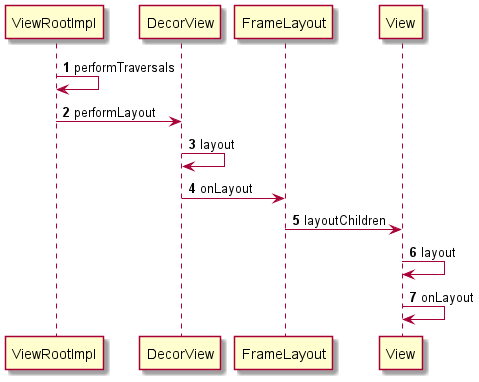

# View的layout



## ViewRootImpl

### `performTraversals()`


```java
	    final boolean didLayout = layoutRequested && (!mStopped || mReportNextDraw);
        boolean triggerGlobalLayoutListener = didLayout
                || mAttachInfo.mRecomputeGlobalAttributes;
        if (didLayout) {
            // 1、layout
            performLayout(lp, mWidth, mHeight);
            
		   // 2、计算透明区域(一般是SurfaceView)，如果发生变化就通知WMS
            if ((host.mPrivateFlags & View.PFLAG_REQUEST_TRANSPARENT_REGIONS) != 0) {
                // start out transparent
                // TODO: AVOID THAT CALL BY CACHING THE RESULT?
                host.getLocationInWindow(mTmpLocation);
                mTransparentRegion.set(mTmpLocation[0], mTmpLocation[1],
                        mTmpLocation[0] + host.mRight - host.mLeft,
                        mTmpLocation[1] + host.mBottom - host.mTop);

                host.gatherTransparentRegion(mTransparentRegion);
                if (mTranslator != null) {
                    mTranslator.translateRegionInWindowToScreen(mTransparentRegion);
                }

                if (!mTransparentRegion.equals(mPreviousTransparentRegion)) {
                    mPreviousTransparentRegion.set(mTransparentRegion);
                    mFullRedrawNeeded = true;
                    // reconfigure window manager
                    try {
                        mWindowSession.setTransparentRegion(mWindow, mTransparentRegion);
                    } catch (RemoteException e) {
                    }
                }
            }
        }
```


### `performLayout()`


```java
	private void performLayout(WindowManager.LayoutParams lp, int desiredWindowWidth,
            int desiredWindowHeight) {
        mScrollMayChange = true;
        mInLayout = true;

        final View host = mView;
        if (host == null) {
            return;
        }

        try {
            /**
             * 首先通过 DecorView.layout() 去layout全局的view树，去拜访所有的子view
             * 其实实际上是ViewGroup.layout() -> View.layout()
             */
            host.layout(0, 0, host.getMeasuredWidth(), host.getMeasuredHeight());

            mInLayout = false;
            int numViewsRequestingLayout = mLayoutRequesters.size();
            if (numViewsRequestingLayout > 0) {
                // requestLayout() was called during layout.
                // If no layout-request flags are set on the requesting views, there is no problem.
                // If some requests are still pending, then we need to clear those flags and do
                // a full request/measure/layout pass to handle this situation.
                ArrayList<View> validLayoutRequesters = getValidLayoutRequesters(mLayoutRequesters,
                        false);
                if (validLayoutRequesters != null) {
                    // Set this flag to indicate that any further requests are happening during
                    // the second pass, which may result in posting those requests to the next
                    // frame instead
                    mHandlingLayoutInLayoutRequest = true;

                    // Process fresh layout requests, then measure and layout
                    int numValidRequests = validLayoutRequesters.size();
                    for (int i = 0; i < numValidRequests; ++i) {
                        final View view = validLayoutRequesters.get(i);
                        Log.w("View", "requestLayout() improperly called by " + view +
                                " during layout: running second layout pass");
                        view.requestLayout();
                    }
                    measureHierarchy(host, lp, mView.getContext().getResources(),
                            desiredWindowWidth, desiredWindowHeight);
                    mInLayout = true;
                    host.layout(0, 0, host.getMeasuredWidth(), host.getMeasuredHeight());

                    mHandlingLayoutInLayoutRequest = false;

                    // Check the valid requests again, this time without checking/clearing the
                    // layout flags, since requests happening during the second pass get noop'd
                    validLayoutRequesters = getValidLayoutRequesters(mLayoutRequesters, true);
                    if (validLayoutRequesters != null) {
                        final ArrayList<View> finalRequesters = validLayoutRequesters;
                        // Post second-pass requests to the next frame
                        getRunQueue().post(new Runnable() {
                            @Override
                            public void run() {
                                int numValidRequests = finalRequesters.size();
                                for (int i = 0; i < numValidRequests; ++i) {
                                    final View view = finalRequesters.get(i);
                                    Log.w("View", "requestLayout() improperly called by " + view +
                                            " during second layout pass: posting in next frame");
                                    view.requestLayout();
                                }
                            }
                        });
                    }
                }

            }
        } finally {
            Trace.traceEnd(Trace.TRACE_TAG_VIEW);
        }
        mInLayout = false;
    }
```


## View

### `layout()`

```java
    public void layout(int l, int t, int r, int b) {
        /**
         * Step 1:
         * 判断PFLAG3_MEASURE_NEEDED_BEFORE_LAYOUT是否开启了。
         * 这个标志位打开的时机是在DecorView.measure()步骤发现原来父容器传递下来的大小不变，就会设置老的测量结果在View中。
         * 在layout的步骤会先调用一次onMeasure继续遍历测量底层的子View的大小。
         *
         * 这是对于layout的优化，
         * 为了优化整个onMeasure和onLayout遍历的逻辑。onMeasure做了缓存处理，
         * 如果判断到父容器的大小不变，则不会遍历到底层的子View中进行测量
         *
         *
         */
        if ((mPrivateFlags3 & PFLAG3_MEASURE_NEEDED_BEFORE_LAYOUT) != 0) {
            onMeasure(mOldWidthMeasureSpec, mOldHeightMeasureSpec);
            mPrivateFlags3 &= ~PFLAG3_MEASURE_NEEDED_BEFORE_LAYOUT;
        }

        int oldL = mLeft;
        int oldT = mTop;
        int oldB = mBottom;
        int oldR = mRight;

        /**
         * Step 2:
         * 判断四个方向的数值是否改变
         * 在setFrame()里，会更新ltrb并判断绘制区域是否发生变化，如果绘制区域变化，就调用invalidate()重绘
         */
        boolean changed = isLayoutModeOptical(mParent) ?
                setOpticalFrame(l, t, r, b) : setFrame(l, t, r, b);

        /**
         * Step 3:
         * 如果大小 或 位置发生改变
         */
        if (changed || (mPrivateFlags & PFLAG_LAYOUT_REQUIRED) == PFLAG_LAYOUT_REQUIRED) {
            /**
             * Step 3.1:
             * onLayout()
             * 对于ViewRootImpl来说，performLayout()时会调用 DecorView.onLayout()
             */
            onLayout(changed, l, t, r, b);

            /**
             * Step 3.2:
             * 如果需要绘制滚动块的话就初始化 RoundScrollbarRenderer
             */
            if (shouldDrawRoundScrollbar()) {
                if(mRoundScrollbarRenderer == null) {
                    mRoundScrollbarRenderer = new RoundScrollbarRenderer(this);
                }
            } else {
                mRoundScrollbarRenderer = null;
            }

            mPrivateFlags &= ~PFLAG_LAYOUT_REQUIRED;

            /**
             * Step 3.3:
             * 回调 onLayoutChange()
             */
            ListenerInfo li = mListenerInfo;
            if (li != null && li.mOnLayoutChangeListeners != null) {
                ArrayList<OnLayoutChangeListener> listenersCopy =
                        (ArrayList<OnLayoutChangeListener>)li.mOnLayoutChangeListeners.clone();
                int numListeners = listenersCopy.size();
                for (int i = 0; i < numListeners; ++i) {
                    listenersCopy.get(i).onLayoutChange(this, l, t, r, b, oldL, oldT, oldR, oldB);
                }
            }
        }

        /**
         * Step 4:
         * 进行焦点处理
         * 当前View的layout的行为进行的同时没有另一个layout进行，说明当前的Layout行为是有效的。
         * 否则如果layout无效，那么就要清楚焦点
         */
        final boolean wasLayoutValid = isLayoutValid();

        mPrivateFlags &= ~PFLAG_FORCE_LAYOUT;
        mPrivateFlags3 |= PFLAG3_IS_LAID_OUT;

        if (!wasLayoutValid && isFocused()) {
            mPrivateFlags &= ~PFLAG_WANTS_FOCUS;
            if (canTakeFocus()) {
                // We have a robust focus, so parents should no longer be wanting focus.
                clearParentsWantFocus();
            } else if (getViewRootImpl() == null || !getViewRootImpl().isInLayout()) {
                // This is a weird case. Most-likely the user, rather than ViewRootImpl, called
                // layout. In this case, there's no guarantee that parent layouts will be evaluated
                // and thus the safest action is to clear focus here.
                clearFocusInternal(null, /* propagate */ true, /* refocus */ false);
                clearParentsWantFocus();
            } else if (!hasParentWantsFocus()) {
                // original requestFocus was likely on this view directly, so just clear focus
                clearFocusInternal(null, /* propagate */ true, /* refocus */ false);
            }
            // otherwise, we let parents handle re-assigning focus during their layout passes.
        } else if ((mPrivateFlags & PFLAG_WANTS_FOCUS) != 0) {
            mPrivateFlags &= ~PFLAG_WANTS_FOCUS;
            View focused = findFocus();
            if (focused != null) {
                // Try to restore focus as close as possible to our starting focus.
                if (!restoreDefaultFocus() && !hasParentWantsFocus()) {
                    // Give up and clear focus once we've reached the top-most parent which wants
                    // focus.
                    focused.clearFocusInternal(null, /* propagate */ true, /* refocus */ false);
                }
            }
        }

        if ((mPrivateFlags3 & PFLAG3_NOTIFY_AUTOFILL_ENTER_ON_LAYOUT) != 0) {
            mPrivateFlags3 &= ~PFLAG3_NOTIFY_AUTOFILL_ENTER_ON_LAYOUT;
            notifyEnterOrExitForAutoFillIfNeeded(true);
        }

        notifyAppearedOrDisappearedForContentCaptureIfNeeded(true);
    }
```


## DecorView

### `onLayout()`

```java
	protected void onLayout(boolean changed, int left, int top, int right, int bottom) {
        /**
         * 调用FrameLayout.onLayout()，确定每一个子View的位置
         */
        super.onLayout(changed, left, top, right, bottom);
        if (mApplyFloatingVerticalInsets) {
            offsetTopAndBottom(mFloatingInsets.top);
        }
        if (mApplyFloatingHorizontalInsets) {
            offsetLeftAndRight(mFloatingInsets.left);
        }

        /**
         * layout之后更新window的阴影
         */
        // If the application changed its SystemUI metrics, we might also have to adapt
        // our shadow elevation.
        updateElevation();
        mAllowUpdateElevation = true;

        /**
         * 调用requestInvalidateRootRenderNode，通知ViweRootImpl中的硬件渲染对象ThreadRenderer进行刷新绘制
         */
        if (changed
                && (mResizeMode == RESIZE_MODE_DOCKED_DIVIDER
                    || mDrawLegacyNavigationBarBackground)) {
            getViewRootImpl().requestInvalidateRootRenderNode();
        }
    }
```


## FrameLayout

### `onLayout()`

```java
	protected void onLayout(boolean changed, int left, int top, int right, int bottom) {
        layoutChildren(left, top, right, bottom, false /* no force left gravity */);
    }
```


### `layoutChildren()`


```java
	void layoutChildren(int left, int top, int right, int bottom, boolean forceLeftGravity) {
        final int count = getChildCount();

        final int parentLeft = getPaddingLeftWithForeground();
        final int parentRight = right - left - getPaddingRightWithForeground();

        final int parentTop = getPaddingTopWithForeground();
        final int parentBottom = bottom - top - getPaddingBottomWithForeground();

        // 遍历子view，确定子view的left和top，再加上测量得到的宽高，得到布局区域
        for (int i = 0; i < count; i++) {
            final View child = getChildAt(i);
            if (child.getVisibility() != GONE) {
                final LayoutParams lp = (LayoutParams) child.getLayoutParams();

                final int width = child.getMeasuredWidth();
                final int height = child.getMeasuredHeight();

                int childLeft;
                int childTop;

                int gravity = lp.gravity;
                if (gravity == -1) {
                    gravity = DEFAULT_CHILD_GRAVITY;
                }

                final int layoutDirection = getLayoutDirection();
                final int absoluteGravity = Gravity.getAbsoluteGravity(gravity, layoutDirection);
                final int verticalGravity = gravity & Gravity.VERTICAL_GRAVITY_MASK;

                // 根据 Gravity 计算 left 和 top
                switch (absoluteGravity & Gravity.HORIZONTAL_GRAVITY_MASK) {  
                    case Gravity.CENTER_HORIZONTAL:
                        // 横向居中
                        childLeft = parentLeft + (parentRight - parentLeft - width) / 2 +
                        lp.leftMargin - lp.rightMargin;
                        break;
                    case Gravity.RIGHT:
                        // 横向靠右
                        if (!forceLeftGravity) {
                            childLeft = parentRight - width - lp.rightMargin;
                            break;
                        }
                    case Gravity.LEFT:
                    default:
                        // 横向靠左
                        childLeft = parentLeft + lp.leftMargin;
                }

                switch (verticalGravity) {
                    case Gravity.TOP:
                        childTop = parentTop + lp.topMargin;
                        break;
                    case Gravity.CENTER_VERTICAL:
                        childTop = parentTop + (parentBottom - parentTop - height) / 2 +
                        lp.topMargin - lp.bottomMargin;
                        break;
                    case Gravity.BOTTOM:
                        childTop = parentBottom - height - lp.bottomMargin;
                        break;
                    default:
                        childTop = parentTop + lp.topMargin;
                }

                child.layout(childLeft, childTop, childLeft + width, childTop + height);
            }
        }
    }
```


## 其他View的onLayout

### `LinearLayout.onLayout()`

```java
	protected void onLayout(boolean changed, int l, int t, int r, int b) {
        if (mOrientation == VERTICAL) {
            layoutVertical(l, t, r, b);
        } else {
            layoutHorizontal(l, t, r, b);
        }
    }
    
    void layoutVertical(int left, int top, int right, int bottom) {
        final int paddingLeft = mPaddingLeft;

        int childTop;
        int childLeft;

        // Where right end of child should go
        final int width = right - left;
        int childRight = width - mPaddingRight;

        // Space available for child
        int childSpace = width - paddingLeft - mPaddingRight;

        final int count = getVirtualChildCount();

        final int majorGravity = mGravity & Gravity.VERTICAL_GRAVITY_MASK;
        final int minorGravity = mGravity & Gravity.RELATIVE_HORIZONTAL_GRAVITY_MASK;

        // 和FrameLayout不同，LinearLayout还需要根据自己的fravity去计算第一个子view开始摆放的top
        switch (majorGravity) {
           case Gravity.BOTTOM:
               // 设置子view在底部显示：
               // 第一个子view的top = viewlayoutPadding + layout高度 - 内容高度
               childTop = mPaddingTop + bottom - top - mTotalLength;
               break;
           case Gravity.CENTER_VERTICAL:
               // 设置子view在居中显示：
               // 第一个子view的top = viewlayoutPadding + （layout高度 - 内容高度） / 2
               childTop = mPaddingTop + (bottom - top - mTotalLength) / 2;
               break;

           case Gravity.TOP:
           default:
               childTop = mPaddingTop;
               break;
        }

        // 遍历每一个子view, 确定子view的left和top，再加上测量得到的宽高，得到布局区域
        for (int i = 0; i < count; i++) {
            final View child = getVirtualChildAt(i);
            if (child == null) {
                childTop += measureNullChild(i);
            } else if (child.getVisibility() != GONE) {
                final int childWidth = child.getMeasuredWidth();
                final int childHeight = child.getMeasuredHeight();

                final LinearLayout.LayoutParams lp =
                        (LinearLayout.LayoutParams) child.getLayoutParams();

                int gravity = lp.gravity;
                if (gravity < 0) {
                    gravity = minorGravity;
                }
                final int layoutDirection = getLayoutDirection();
                final int absoluteGravity = Gravity.getAbsoluteGravity(gravity, layoutDirection);
                switch (absoluteGravity & Gravity.HORIZONTAL_GRAVITY_MASK) {
                    case Gravity.CENTER_HORIZONTAL:
                        childLeft = paddingLeft + ((childSpace - childWidth) / 2)
                                + lp.leftMargin - lp.rightMargin;
                        break;

                    case Gravity.RIGHT:
                        childLeft = childRight - childWidth - lp.rightMargin;
                        break;

                    case Gravity.LEFT:
                    default:
                        childLeft = paddingLeft + lp.leftMargin;
                        break;
                }

                if (hasDividerBeforeChildAt(i)) {
                    childTop += mDividerHeight;
                }

                childTop += lp.topMargin;
                /**
                 * 等价与
                 * child.layout(
                 *      childLeft， 
                 *      childTop + getLocationOffset(child)， 
                 *      childLeft + childWidth， 
                 *      childTop + getLocationOffset(child) + childHeight)
                 */
                setChildFrame(child, childLeft, childTop + getLocationOffset(child),
                        childWidth, childHeight);
                childTop += childHeight + lp.bottomMargin + getNextLocationOffset(child);

                i += getChildrenSkipCount(child, i);
            }
        }
    }
```


### `RelativeLayout.onLayout()`

由于在onMeasure的7次遍历中已经处理好了对应的摆放逻辑了。因此这里指简单的遍历一次每一个子View的layout方法即可。

```java
	protected void onLayout(boolean changed, int l, int t, int r, int b) {
        //  The layout has actually already been performed and the positions
        //  cached.  Apply the cached values to the children.
        final int count = getChildCount();

        for (int i = 0; i < count; i++) {
            View child = getChildAt(i);
            if (child.getVisibility() != GONE) {
                RelativeLayout.LayoutParams st =
                        (RelativeLayout.LayoutParams) child.getLayoutParams();
                child.layout(st.mLeft, st.mTop, st.mRight, st.mBottom);
            }
        }
    }
```

