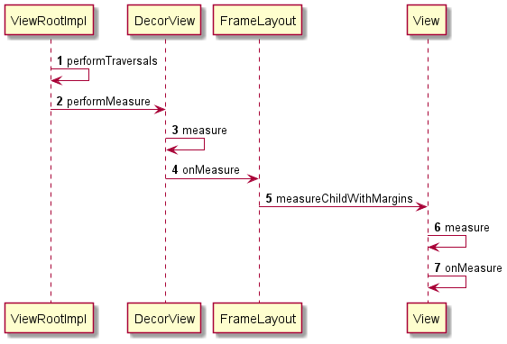

# DecorView的measure



## ViewRootImpl

### `performTraversals()`

```java
		if (mFirst || windowShouldResize || viewVisibilityChanged || cutoutChanged || params != null
                || mForceNextWindowRelayout) {
            mForceNextWindowRelayout = false;
            ......
         	if (!mStopped || mReportNextDraw) {
                // 调用ensureTouchModeLocally处理touchMode以及焦点
                boolean focusChangedDueToTouchMode = ensureTouchModeLocally(
                        (relayoutResult&WindowManagerGlobal.RELAYOUT_RES_IN_TOUCH_MODE) != 0);
                if (focusChangedDueToTouchMode 
                    || mWidth != host.getMeasuredWidth() || mHeight != host.getMeasuredHeight() 
                    || dispatchApplyInsets || mupdatedConfiguration) {
                    int childWidthMeasureSpec = getRootMeasureSpec(mWidth, lp.width);
                    int childHeightMeasureSpec = getRootMeasureSpec(mHeight, lp.height);

                     // Ask host how big it wants to be
                    performMeasure(childWidthMeasureSpec, childHeightMeasureSpec);

                    // Implementation of weights from WindowManager.LayoutParams
                    // We just grow the dimensions as needed and re-measure if
                    // needs be
                    int width = host.getMeasuredWidth();
                    int height = host.getMeasuredHeight();
                    boolean measureAgain = false;

                    // 如果设置了weight权重，那么后续还会再measure一次
                    if (lp.horizontalWeight > 0.0f) {
                        width += (int) ((mWidth - width) * lp.horizontalWeight);
                        childWidthMeasureSpec = MeasureSpec.makeMeasureSpec(width,
                                MeasureSpec.EXACTLY);
                        measureAgain = true;
                    }
                    if (lp.verticalWeight > 0.0f) {
                        height += (int) ((mHeight - height) * lp.verticalWeight);
                        childHeightMeasureSpec = MeasureSpec.makeMeasureSpec(height,
                                MeasureSpec.EXACTLY);
                        measureAgain = true;
                    }

                    if (measureAgain) {
                        performMeasure(childWidthMeasureSpec, childHeightMeasureSpec);
                    }

                    layoutRequested = true;
                }
            }   
         }
```


#### `getRootMeasureSpec()`

判断DecorView的 LayoutParams

* MATCH_PARENT ：size 精确为窗口大小
* WRAP_CONTENT：size最大不超和窗口大小
* 否则 size精确为 LayoutParams大小

```java
	private static int getRootMeasureSpec(int windowSize, int rootDimension) {
        int measureSpec;
        switch (rootDimension) {

        case ViewGroup.LayoutParams.MATCH_PARENT:
            // Window can't resize. Force root view to be windowSize.
            measureSpec = MeasureSpec.makeMeasureSpec(windowSize, MeasureSpec.EXACTLY);
            break;
        case ViewGroup.LayoutParams.WRAP_CONTENT:
            // Window can resize. Set max size for root view.
            measureSpec = MeasureSpec.makeMeasureSpec(windowSize, MeasureSpec.AT_MOST);
            break;
        default:
            // Window wants to be an exact size. Force root view to be that size.
            measureSpec = MeasureSpec.makeMeasureSpec(rootDimension, MeasureSpec.EXACTLY);
            break;
        }
        return measureSpec;
    }
```


#### `performMeasure()`

```java
private void performMeasure(int childWidthMeasureSpec, int childHeightMeasureSpec) {
    if (mView == null) {
        return;
    }
    Trace.traceBegin(Trace.TRACE_TAG_VIEW, "measure");
    try {
        // 实际上是调用 DecorView.measure()
        mView.measure(childWidthMeasureSpec, childHeightMeasureSpec);
    } finally {
        Trace.traceEnd(Trace.TRACE_TAG_VIEW);
    }
}
```


## View

### `measure()`


```java
	public final void measure(int widthMeasureSpec, int heightMeasureSpec) {
        boolean optical = isLayoutModeOptical(this);
        // 
        if (optical != isLayoutModeOptical(mParent)) {
            Insets insets = getOpticalInsets();
            int oWidth  = insets.left + insets.right;
            int oHeight = insets.top  + insets.bottom;
            widthMeasureSpec  = MeasureSpec.adjust(widthMeasureSpec,  optical ? -oWidth  : oWidth);
            heightMeasureSpec = MeasureSpec.adjust(heightMeasureSpec, optical ? -oHeight : oHeight);
        }

        // Suppress sign extension for the low bytes
        long key = (long) widthMeasureSpec << 32 | (long) heightMeasureSpec & 0xffffffffL;
        if (mMeasureCache == null) mMeasureCache = new LongSparseLongArray(2);

        final boolean forceLayout = (mPrivateFlags & PFLAG_FORCE_LAYOUT) == PFLAG_FORCE_LAYOUT;

        // Optimize layout by avoiding an extra EXACTLY pass when the view is
        // already measured as the correct size. In API 23 and below, this
        // extra pass is required to make LinearLayout re-distribute weight.
        final boolean specChanged = widthMeasureSpec != mOldWidthMeasureSpec
                || heightMeasureSpec != mOldHeightMeasureSpec;
        final boolean isSpecExactly = MeasureSpec.getMode(widthMeasureSpec) == MeasureSpec.EXACTLY
                && MeasureSpec.getMode(heightMeasureSpec) == MeasureSpec.EXACTLY;
        final boolean matchesSpecSize = getMeasuredWidth() == MeasureSpec.getSize(widthMeasureSpec)
                && getMeasuredHeight() == MeasureSpec.getSize(heightMeasureSpec);
        final boolean needsLayout = specChanged
                && (sAlwaysRemeasureExactly || !isSpecExactly || !matchesSpecSize);

        if (forceLayout || needsLayout) {
            // first clears the measured dimension flag
            mPrivateFlags &= ~PFLAG_MEASURED_DIMENSION_SET;

            resolveRtlPropertiesIfNeeded();

            /**
             * 先在缓存里查找，
             * 如果是 强制layout 或者 缓存里没有 或者 忽略缓存（低版本才会），就去 measure
             * 否则的直接拿 缓存的测量值
             */
            int cacheIndex = forceLayout ? -1 : mMeasureCache.indexOfKey(key);
            if (cacheIndex < 0 || sIgnoreMeasureCache) {
                // measure ourselves, this should set the measured dimension flag back
                onMeasure(widthMeasureSpec, heightMeasureSpec);
                mPrivateFlags3 &= ~PFLAG3_MEASURE_NEEDED_BEFORE_LAYOUT;
            } else {
                long value = mMeasureCache.valueAt(cacheIndex);
                // Casting a long to int drops the high 32 bits, no mask needed
                setMeasuredDimensionRaw((int) (value >> 32), (int) value);
                mPrivateFlags3 |= PFLAG3_MEASURE_NEEDED_BEFORE_LAYOUT;
            }

            // flag not set, setMeasuredDimension() was not invoked, we raise
            // an exception to warn the developer
            if ((mPrivateFlags & PFLAG_MEASURED_DIMENSION_SET) != PFLAG_MEASURED_DIMENSION_SET) {
                throw new IllegalStateException("View with id " + getId() + ": "
                        + getClass().getName() + "#onMeasure() did not set the"
                        + " measured dimension by calling"
                        + " setMeasuredDimension()");
            }

            mPrivateFlags |= PFLAG_LAYOUT_REQUIRED;
        }

        mOldWidthMeasureSpec = widthMeasureSpec;
        mOldHeightMeasureSpec = heightMeasureSpec;

        /**
         * 把当前的测量结果放到缓存里
         */
        mMeasureCache.put(key, ((long) mMeasuredWidth) << 32 |
                (long) mMeasuredHeight & 0xffffffffL); // suppress sign extension
    }
```


## DecorView

### `onMeasure()`

```java
	protected void onMeasure(int widthMeasureSpec, int heightMeasureSpec) {
        final DisplayMetrics metrics = getContext().getResources().getDisplayMetrics();
        final boolean isPortrait =
                getResources().getConfiguration().orientation == ORIENTATION_PORTRAIT;

        final int widthMode = getMode(widthMeasureSpec);
        final int heightMode = getMode(heightMeasureSpec);

        boolean fixedWidth = false;
        mApplyFloatingHorizontalInsets = false;
        
        // 宽高为 AT_MOST 的情况下，宽高不能大于窗口宽高
        if (widthMode == AT_MOST) {
            final TypedValue tvw = isPortrait ? mWindow.mFixedWidthMinor : mWindow.mFixedWidthMajor;
            if (tvw != null && tvw.type != TypedValue.TYPE_NULL) {
                final int w;
                if (tvw.type == TypedValue.TYPE_DIMENSION) {
                    w = (int) tvw.getDimension(metrics);
                } else if (tvw.type == TypedValue.TYPE_FRACTION) {
                    w = (int) tvw.getFraction(metrics.widthPixels, metrics.widthPixels);
                } else {
                    w = 0;
                }
                if (DEBUG_MEASURE) Log.d(mLogTag, "Fixed width: " + w);
                final int widthSize = MeasureSpec.getSize(widthMeasureSpec);
                if (w > 0) {
                    widthMeasureSpec = MeasureSpec.makeMeasureSpec(
                            Math.min(w, widthSize), EXACTLY);
                    fixedWidth = true;
                } else {
                    widthMeasureSpec = MeasureSpec.makeMeasureSpec(
                            widthSize - mFloatingInsets.left - mFloatingInsets.right,
                            AT_MOST);
                    mApplyFloatingHorizontalInsets = true;
                }
            }
        }

        mApplyFloatingVerticalInsets = false;
        if (heightMode == AT_MOST) {
            final TypedValue tvh = isPortrait ? mWindow.mFixedHeightMajor
                    : mWindow.mFixedHeightMinor;
            if (tvh != null && tvh.type != TypedValue.TYPE_NULL) {
                final int h;
                if (tvh.type == TypedValue.TYPE_DIMENSION) {
                    h = (int) tvh.getDimension(metrics);
                } else if (tvh.type == TypedValue.TYPE_FRACTION) {
                    h = (int) tvh.getFraction(metrics.heightPixels, metrics.heightPixels);
                } else {
                    h = 0;
                }
                if (DEBUG_MEASURE) Log.d(mLogTag, "Fixed height: " + h);
                final int heightSize = MeasureSpec.getSize(heightMeasureSpec);
                if (h > 0) {
                    heightMeasureSpec = MeasureSpec.makeMeasureSpec(
                            Math.min(h, heightSize), EXACTLY);
                } else if ((mWindow.getAttributes().flags & FLAG_LAYOUT_IN_SCREEN) == 0) {
                    heightMeasureSpec = MeasureSpec.makeMeasureSpec(
                            heightSize - mFloatingInsets.top - mFloatingInsets.bottom, AT_MOST);
                    mApplyFloatingVerticalInsets = true;
                }
            }
        }
		
        // 
        super.onMeasure(widthMeasureSpec, heightMeasureSpec);

        int width = getMeasuredWidth();
        boolean measure = false;

        widthMeasureSpec = MeasureSpec.makeMeasureSpec(width, EXACTLY);

        // 如果发现在style资源中设置了mMinWidthMinor也就是windowMinWidthMinor标签,那也要限制宽高
        if (!fixedWidth && widthMode == AT_MOST) {
            final TypedValue tv = isPortrait ? mWindow.mMinWidthMinor : mWindow.mMinWidthMajor;
            if (tv.type != TypedValue.TYPE_NULL) {
                final int min;
                if (tv.type == TypedValue.TYPE_DIMENSION) {
                    min = (int)tv.getDimension(metrics);
                } else if (tv.type == TypedValue.TYPE_FRACTION) {
                    min = (int)tv.getFraction(mAvailableWidth, mAvailableWidth);
                } else {
                    min = 0;
                }
                if (DEBUG_MEASURE) Log.d(mLogTag, "Adjust for min width: " + min + ", value::"
                        + tv.coerceToString() + ", mAvailableWidth=" + mAvailableWidth);

                if (width < min) {
                    widthMeasureSpec = MeasureSpec.makeMeasureSpec(min, EXACTLY);
                    measure = true;
                }
            }
        }

        // TODO: Support height?

        if (measure) {
            super.onMeasure(widthMeasureSpec, heightMeasureSpec);
        }
    }
```


## FrameLayout

### `onMeasure()`

```java
protected void onMeasure(int widthMeasureSpec, int heightMeasureSpec) {
        int count = getChildCount();

        final boolean measureMatchParentChildren =
                MeasureSpec.getMode(widthMeasureSpec) != MeasureSpec.EXACTLY ||
                MeasureSpec.getMode(heightMeasureSpec) != MeasureSpec.EXACTLY;
        mMatchParentChildren.clear();

        int maxHeight = 0;
        int maxWidth = 0;
        int childState = 0;

        for (int i = 0; i < count; i++) {
            final View child = getChildAt(i);
            if (mMeasureAllChildren || child.getVisibility() != GONE) {
                // 让子view 带着 当前父布局的padding和 自己的margin进行测量
                measureChildWithMargins(child, widthMeasureSpec, 0, heightMeasureSpec, 0);
                
                // FrameLayout 需要在遍历过程中找到最大的宽高
                final LayoutParams lp = (LayoutParams) child.getLayoutParams();
                maxWidth = Math.max(maxWidth,
                        child.getMeasuredWidth() + lp.leftMargin + lp.rightMargin);
                maxHeight = Math.max(maxHeight,
                        child.getMeasuredHeight() + lp.topMargin + lp.bottomMargin);
                // 合并每一个子View的测量模式，这样可以知道子view一共有多少种测量模式
                childState = combineMeasuredStates(childState, child.getMeasuredState());
                // 如果FrameLayout的测量模式不是 精确模式，也就表示自己的宽高还不能确定，
                // 因此需要先记录下设置了MATCH_PARENT的子view，
                // 这样等到测量完所有子view才能确定自己的宽高，才能确定测量模式为MATCH_PARENT的子view的宽高
                if (measureMatchParentChildren) {
                    if (lp.width == LayoutParams.MATCH_PARENT ||
                            lp.height == LayoutParams.MATCH_PARENT) {
                        mMatchParentChildren.add(child);
                    }
                }
            }
        }

        // Account for padding too
        maxWidth += getPaddingLeftWithForeground() + getPaddingRightWithForeground();
        maxHeight += getPaddingTopWithForeground() + getPaddingBottomWithForeground();

        // Check against our minimum height and width
        maxHeight = Math.max(maxHeight, getSuggestedMinimumHeight());
        maxWidth = Math.max(maxWidth, getSuggestedMinimumWidth());

        // Check against our foreground's minimum height and width
        final Drawable drawable = getForeground();
        if (drawable != null) {
            maxHeight = Math.max(maxHeight, drawable.getMinimumHeight());
            maxWidth = Math.max(maxWidth, drawable.getMinimumWidth());
        }

    	// 计算好最大宽高后，
    	// resolveSizeAndState会把size和mode合成一个MeasureSpec，
    	// 然后setMeasuredDimension设置
        setMeasuredDimension(resolveSizeAndState(maxWidth, widthMeasureSpec, childState),
                resolveSizeAndState(maxHeight, heightMeasureSpec,
                        childState << MEASURED_HEIGHT_STATE_SHIFT));
		
    	// 当FrameLayout的宽高确定后，再去确定设置了 MATCH_PARENT的子view
        count = mMatchParentChildren.size();
        if (count > 1) {
            for (int i = 0; i < count; i++) {
                final View child = mMatchParentChildren.get(i);
                final MarginLayoutParams lp = (MarginLayoutParams) child.getLayoutParams();

                final int childWidthMeasureSpec;
                if (lp.width == LayoutParams.MATCH_PARENT) {
                    final int width = Math.max(0, getMeasuredWidth()
                            - getPaddingLeftWithForeground() - getPaddingRightWithForeground()
                            - lp.leftMargin - lp.rightMargin);
                    childWidthMeasureSpec = MeasureSpec.makeMeasureSpec(
                            width, MeasureSpec.EXACTLY);
                } else {
                    childWidthMeasureSpec = getChildMeasureSpec(widthMeasureSpec,
                            getPaddingLeftWithForeground() + getPaddingRightWithForeground() +
                            lp.leftMargin + lp.rightMargin,
                            lp.width);
                }

                final int childHeightMeasureSpec;
                if (lp.height == LayoutParams.MATCH_PARENT) {
                    final int height = Math.max(0, getMeasuredHeight()
                            - getPaddingTopWithForeground() - getPaddingBottomWithForeground()
                            - lp.topMargin - lp.bottomMargin);
                    childHeightMeasureSpec = MeasureSpec.makeMeasureSpec(
                            height, MeasureSpec.EXACTLY);
                } else {
                    childHeightMeasureSpec = getChildMeasureSpec(heightMeasureSpec,
                            getPaddingTopWithForeground() + getPaddingBottomWithForeground() +
                            lp.topMargin + lp.bottomMargin,
                            lp.height);
                }

                child.measure(childWidthMeasureSpec, childHeightMeasureSpec);
            }
        }
    }
```


## ViewGroup

### `measureChildWithMargins()`

对于子view来说，需要把自己的margin和父view的padding加入测量计算

```java
	protected void measureChildWithMargins(View child,
            int parentWidthMeasureSpec, int widthUsed,
            int parentHeightMeasureSpec, int heightUsed) {
        final MarginLayoutParams lp = (MarginLayoutParams) child.getLayoutParams();

        final int childWidthMeasureSpec = getChildMeasureSpec(parentWidthMeasureSpec,
                mPaddingLeft + mPaddingRight + lp.leftMargin + lp.rightMargin
                        + widthUsed, lp.width);
        final int childHeightMeasureSpec = getChildMeasureSpec(parentHeightMeasureSpec,
                mPaddingTop + mPaddingBottom + lp.topMargin + lp.bottomMargin
                        + heightUsed, lp.height);

        child.measure(childWidthMeasureSpec, childHeightMeasureSpec);
    }
```


### `getChildMeasureSpec()`

|                    | 子size 精确值    | 子size MATCH_PARENT          | 子size WRAP_CONTENT          |
| ------------------ | ---------------- | ---------------------------- | ---------------------------- |
| 父mode EXACTLY     | (子size,EXACTLY) | (父size-padding,EXACTLY)     | (父size-padding,AT_MOST)     |
| 父mode AT_MOST     | (子size,EXACTLY) | (父size-padding,AT_MOST)     | (父size-padding,AT_MOST)     |
| 父mode UNSPECIFIED | (子size,EXACTLY) | (父size-padding,UNSPECIFIED) | (父size-padding,UNSPECIFIED) |

* 父view有精确大小时，传递给子View的是精确模式和精确数值。
* 子size为MATCH_PARENT或者WRAP_CONTENT，大小为当前大小减去padding+margin数值。模式跟着父view走

```java
public static int getChildMeasureSpec(int spec, int padding, int childDimension) {
        int specMode = MeasureSpec.getMode(spec);
        int specSize = MeasureSpec.getSize(spec);

        int size = Math.max(0, specSize - padding);

        int resultSize = 0;
        int resultMode = 0;

        switch (specMode) {
        // Parent has imposed an exact size on us
        case MeasureSpec.EXACTLY:
            if (childDimension >= 0) {
                resultSize = childDimension;
                resultMode = MeasureSpec.EXACTLY;
            } else if (childDimension == LayoutParams.MATCH_PARENT) {
                // Child wants to be our size. So be it.
                resultSize = size;
                resultMode = MeasureSpec.EXACTLY;
            } else if (childDimension == LayoutParams.WRAP_CONTENT) {
                // Child wants to determine its own size. It can't be
                // bigger than us.
                resultSize = size;
                resultMode = MeasureSpec.AT_MOST;
            }
            break;

        // Parent has imposed a maximum size on us
        case MeasureSpec.AT_MOST:
            if (childDimension >= 0) {
                // Child wants a specific size... so be it
                resultSize = childDimension;
                resultMode = MeasureSpec.EXACTLY;
            } else if (childDimension == LayoutParams.MATCH_PARENT) {
                // Child wants to be our size, but our size is not fixed.
                // Constrain child to not be bigger than us.
                resultSize = size;
                resultMode = MeasureSpec.AT_MOST;
            } else if (childDimension == LayoutParams.WRAP_CONTENT) {
                // Child wants to determine its own size. It can't be
                // bigger than us.
                resultSize = size;
                resultMode = MeasureSpec.AT_MOST;
            }
            break;

        // Parent asked to see how big we want to be
        case MeasureSpec.UNSPECIFIED:
            if (childDimension >= 0) {
                // Child wants a specific size... let them have it
                resultSize = childDimension;
                resultMode = MeasureSpec.EXACTLY;
            } else if (childDimension == LayoutParams.MATCH_PARENT) {
                // Child wants to be our size... find out how big it should
                // be
                resultSize = View.sUseZeroUnspecifiedMeasureSpec ? 0 : size;
                resultMode = MeasureSpec.UNSPECIFIED;
            } else if (childDimension == LayoutParams.WRAP_CONTENT) {
                // Child wants to determine its own size.... find out how
                // big it should be
                resultSize = View.sUseZeroUnspecifiedMeasureSpec ? 0 : size;
                resultMode = MeasureSpec.UNSPECIFIED;
            }
            break;
        }
        //noinspection ResourceType
        return MeasureSpec.makeMeasureSpec(resultSize, resultMode);
    }
```


## 其他View的onMeasure()

### `View.onMeasure()`

* 父view mode为AT_MOST或EXACTLY时，子view宽高为父view的宽高
* 父view mode为UNSPECIFIED，子view宽高根据背景Drawable最小宽高以及设定的最小宽高取值

```java
	protected void onMeasure(int widthMeasureSpec, int heightMeasureSpec) {
        setMeasuredDimension(
            getDefaultSize(getSuggestedMinimumWidth(), widthMeasureSpec),
            getDefaultSize(getSuggestedMinimumHeight(), heightMeasureSpec));
    }

	public static int getDefaultSize(int size, int measureSpec) {
        int result = size;
        int specMode = MeasureSpec.getMode(measureSpec);
        int specSize = MeasureSpec.getSize(measureSpec);

        switch (specMode) {
        case MeasureSpec.UNSPECIFIED:
            result = size;
            break;
        case MeasureSpec.AT_MOST:
        case MeasureSpec.EXACTLY:
            result = specSize;
            break;
        }
        return result;
    }

	protected int getSuggestedMinimumWidth() {
        return (mBackground == null) ? mMinWidth : max(mMinWidth, mBackground.getMinimumWidth());
    }

	protected int getSuggestedMinimumHeight() {
        return (mBackground == null) ? mMinHeight : max(mMinHeight, mBackground.getMinimumHeight());

    }
	
```


### `LinearLayout onMeasure()`


```java
	protected void onMeasure(int widthMeasureSpec, int heightMeasureSpec) {
        if (mOrientation == VERTICAL) {
            measureVertical(widthMeasureSpec, heightMeasureSpec);
        } else {
            measureHorizontal(widthMeasureSpec, heightMeasureSpec);
        }
    }
    
    void measureVertical(int widthMeasureSpec, int heightMeasureSpec) {
        mTotalLength = 0;
        int maxWidth = 0;
        int childState = 0;
        int alternativeMaxWidth = 0;
        int weightedMaxWidth = 0;
        boolean allFillParent = true;
        float totalWeight = 0;

        final int count = getVirtualChildCount();

        final int widthMode = MeasureSpec.getMode(widthMeasureSpec);
        final int heightMode = MeasureSpec.getMode(heightMeasureSpec);

        boolean matchWidth = false;
        boolean skippedMeasure = false;

        final int baselineChildIndex = mBaselineAlignedChildIndex;
        final boolean useLargestChild = mUseLargestChild;

        int largestChildHeight = Integer.MIN_VALUE;
        int consumedExcessSpace = 0;

        int nonSkippedChildCount = 0;

        // 1、第一次循环遍历子view
        for (int i = 0; i < count; ++i) {
            // 1.1 如果子View为null或者不可见，就跳过measure
            final View child = getVirtualChildAt(i);
            if (child == null) {
                mTotalLength += measureNullChild(i);
                continue;
            }

            if (child.getVisibility() == View.GONE) {
               i += getChildrenSkipCount(child, i);
               continue;
            }

            nonSkippedChildCount++;
            // 1.2 如果设置了分割线，就加上分割线的高度
            if (hasDividerBeforeChildAt(i)) {
                mTotalLength += mDividerHeight;
            }
			
            // 获取每一个子view的weight，然后计算总权重，以便后续计算
            final LayoutParams lp = (LayoutParams) child.getLayoutParams();

            totalWeight += lp.weight;
			
            // 如果当前子view高度为0，权重不为0，就说明需要利用父view的剩余空间进行划分
            final boolean useExcessSpace = lp.height == 0 && lp.weight > 0;
            if (heightMode == MeasureSpec.EXACTLY && useExcessSpace) {
                // Optimization: don't bother measuring children who are only
                // laid out using excess space. These views will get measured
                // later if we have space to distribute.
                final int totalLength = mTotalLength;
                mTotalLength = Math.max(totalLength, totalLength + lp.topMargin + lp.bottomMargin);
                skippedMeasure = true;
            } else {
                if (useExcessSpace) {
                    // 为了方便后面调用measureChildBeforeLayout()计算出view的最佳高度
                    lp.height = LayoutParams.WRAP_CONTENT;
                }

                // 暂时先设为0或者分割线高度，然后开始对子view开始测量，
                // 实际上也也是调用measureChildWithMargins，加入margin和padding参与计算
                final int usedHeight = totalWeight == 0 ? mTotalLength : 0;
                measureChildBeforeLayout(child, i, widthMeasureSpec, 0,
                        heightMeasureSpec, usedHeight);

                final int childHeight = child.getMeasuredHeight();
                if (useExcessSpace) {
                    // 调用measureChildBeforeLayout()恢复为0
                    lp.height = 0;
                    consumedExcessSpace += childHeight;
                }

                // 累加到总高度，不包括weight为0的子view
                final int totalLength = mTotalLength;
                mTotalLength = Math.max(totalLength, totalLength + childHeight + lp.topMargin +
                       lp.bottomMargin + getNextLocationOffset(child));

                if (useLargestChild) {
                    largestChildHeight = Math.max(childHeight, largestChildHeight);
                }
            }

            /**
             * If applicable, compute the additional offset to the child's baseline
             * we'll need later when asked {@link #getBaseline}.
             */
            if ((baselineChildIndex >= 0) && (baselineChildIndex == i + 1)) {
               mBaselineChildTop = mTotalLength;
            }

            // if we are trying to use a child index for our baseline, the above
            // book keeping only works if there are no children above it with
            // weight.  fail fast to aid the developer.
            if (i < baselineChildIndex && lp.weight > 0) {
                throw new RuntimeException("A child of LinearLayout with index "
                        + "less than mBaselineAlignedChildIndex has weight > 0, which "
                        + "won't work.  Either remove the weight, or don't set "
                        + "mBaselineAlignedChildIndex.");
            }

            boolean matchWidthLocally = false;
            if (widthMode != MeasureSpec.EXACTLY && lp.width == LayoutParams.MATCH_PARENT) {
                // The width of the linear layout will scale, and at least one
                // child said it wanted to match our width. Set a flag
                // indicating that we need to remeasure at least that view when
                // we know our width.
                matchWidth = true;
                matchWidthLocally = true;
            }

            final int margin = lp.leftMargin + lp.rightMargin;
            final int measuredWidth = child.getMeasuredWidth() + margin;
            maxWidth = Math.max(maxWidth, measuredWidth);
            childState = combineMeasuredStates(childState, child.getMeasuredState());

            allFillParent = allFillParent && lp.width == LayoutParams.MATCH_PARENT;
            if (lp.weight > 0) {
                /*
                 * Widths of weighted Views are bogus if we end up
                 * remeasuring, so keep them separate.
                 */
                weightedMaxWidth = Math.max(weightedMaxWidth,
                        matchWidthLocally ? margin : measuredWidth);
            } else {
                alternativeMaxWidth = Math.max(alternativeMaxWidth,
                        matchWidthLocally ? margin : measuredWidth);
            }

            i += getChildrenSkipCount(child, i);
        }

        if (nonSkippedChildCount > 0 && hasDividerBeforeChildAt(count)) {
            mTotalLength += mDividerHeight;
        }

        // 如果LinearLayout的父容器高度不是MeasureSpec.EXACTLY，
        // 但是LinearLayout的高度是LayoutParams.MATCH_PARENT模式。每一次都开始不断的遍历找到最大的高度。
        if (useLargestChild &&
                (heightMode == MeasureSpec.AT_MOST || heightMode == MeasureSpec.UNSPECIFIED)) {
            mTotalLength = 0;

            for (int i = 0; i < count; ++i) {
                final View child = getVirtualChildAt(i);
                if (child == null) {
                    mTotalLength += measureNullChild(i);
                    continue;
                }

                if (child.getVisibility() == GONE) {
                    i += getChildrenSkipCount(child, i);
                    continue;
                }

                final LinearLayout.LayoutParams lp = (LinearLayout.LayoutParams)
                        child.getLayoutParams();
                // Account for negative margins
                final int totalLength = mTotalLength;
                mTotalLength = Math.max(totalLength, totalLength + largestChildHeight +
                        lp.topMargin + lp.bottomMargin + getNextLocationOffset(child));
            }
        }

        // Add in our padding
        mTotalLength += mPaddingTop + mPaddingBottom;

        int heightSize = mTotalLength;

        // Check against our minimum height
        heightSize = Math.max(heightSize, getSuggestedMinimumHeight());

        // Reconcile our calculated size with the heightMeasureSpec
        int heightSizeAndState = resolveSizeAndState(heightSize, heightMeasureSpec, 0);
        heightSize = heightSizeAndState & MEASURED_SIZE_MASK;
        // 计算得到剩余的空间，分配给设置了weight的子view
        int remainingExcess = heightSize - mTotalLength
                + (mAllowInconsistentMeasurement ? 0 : consumedExcessSpace);
        if (skippedMeasure
                || ((sRemeasureWeightedChildren || remainingExcess != 0) && totalWeight > 0.0f)) {
            float remainingWeightSum = mWeightSum > 0.0f ? mWeightSum : totalWeight;

            mTotalLength = 0;

            for (int i = 0; i < count; ++i) {
                final View child = getVirtualChildAt(i);
                if (child == null || child.getVisibility() == View.GONE) {
                    continue;
                }

                final LayoutParams lp = (LayoutParams) child.getLayoutParams();
                final float childWeight = lp.weight;
                if (childWeight > 0) {
                    final int share = (int) (childWeight * remainingExcess / remainingWeightSum);
                    remainingExcess -= share;
                    remainingWeightSum -= childWeight;

                    final int childHeight;
                    if (mUseLargestChild && heightMode != MeasureSpec.EXACTLY) {
                        childHeight = largestChildHeight;
                    } else if (lp.height == 0 && (!mAllowInconsistentMeasurement
                            || heightMode == MeasureSpec.EXACTLY)) {
                        // This child needs to be laid out from scratch using
                        // only its share of excess space.
                        childHeight = share;
                    } else {
                        // This child had some intrinsic height to which we
                        // need to add its share of excess space.
                        childHeight = child.getMeasuredHeight() + share;
                    }

                    final int childHeightMeasureSpec = MeasureSpec.makeMeasureSpec(
                            Math.max(0, childHeight), MeasureSpec.EXACTLY);
                    final int childWidthMeasureSpec = getChildMeasureSpec(widthMeasureSpec,
                            mPaddingLeft + mPaddingRight + lp.leftMargin + lp.rightMargin,
                            lp.width);
                    // 子view按照分配到的宽高重新测量
                    child.measure(childWidthMeasureSpec, childHeightMeasureSpec);

                    // Child may now not fit in vertical dimension.
                    childState = combineMeasuredStates(childState, child.getMeasuredState()
                            & (MEASURED_STATE_MASK>>MEASURED_HEIGHT_STATE_SHIFT));
                }

                final int margin =  lp.leftMargin + lp.rightMargin;
                final int measuredWidth = child.getMeasuredWidth() + margin;
                maxWidth = Math.max(maxWidth, measuredWidth);

                boolean matchWidthLocally = widthMode != MeasureSpec.EXACTLY &&
                        lp.width == LayoutParams.MATCH_PARENT;

                alternativeMaxWidth = Math.max(alternativeMaxWidth,
                        matchWidthLocally ? margin : measuredWidth);

                allFillParent = allFillParent && lp.width == LayoutParams.MATCH_PARENT;

                // 继续更新总高度
                final int totalLength = mTotalLength;
                mTotalLength = Math.max(totalLength, totalLength + child.getMeasuredHeight() +
                        lp.topMargin + lp.bottomMargin + getNextLocationOffset(child));
            }

            // Add in our padding
            mTotalLength += mPaddingTop + mPaddingBottom;
            // TODO: Should we recompute the heightSpec based on the new total length?
        } else {
            alternativeMaxWidth = Math.max(alternativeMaxWidth,
                                           weightedMaxWidth);


            // We have no limit, so make all weighted views as tall as the largest child.
            // Children will have already been measured once.
            if (useLargestChild && heightMode != MeasureSpec.EXACTLY) {
                for (int i = 0; i < count; i++) {
                    final View child = getVirtualChildAt(i);
                    if (child == null || child.getVisibility() == View.GONE) {
                        continue;
                    }

                    final LinearLayout.LayoutParams lp =
                            (LinearLayout.LayoutParams) child.getLayoutParams();

                    float childExtra = lp.weight;
                    if (childExtra > 0) {
                        child.measure(
                                MeasureSpec.makeMeasureSpec(child.getMeasuredWidth(),
                                        MeasureSpec.EXACTLY),
                                MeasureSpec.makeMeasureSpec(largestChildHeight,
                                        MeasureSpec.EXACTLY));
                    }
                }
            }
        }

        if (!allFillParent && widthMode != MeasureSpec.EXACTLY) {
            maxWidth = alternativeMaxWidth;
        }

        maxWidth += mPaddingLeft + mPaddingRight;

        // Check against our minimum width
        maxWidth = Math.max(maxWidth, getSuggestedMinimumWidth());

        setMeasuredDimension(resolveSizeAndState(maxWidth, widthMeasureSpec, childState),
                heightSizeAndState);

        if (matchWidth) {
            forceUniformWidth(count, heightMeasureSpec);
        }
    }
```


## 总结

### ViewRootIml调用  `performMeasure()`的条件

```java
if (mFirst ||                  // 第一次渲染
    windowShouldResize ||      // 窗口发生了变化
    viewVisibilityChanged ||   // DecorView可见性发生了变化
    cutoutChanged ||           // Inset的区域发生了变化
    params != null ||          // 如果mWindowAttributes不为空
    mForceNextWindowRelayout) {// 整个ViewRoot的Configuration发生了变化，比如横竖屏切换，资源主题的切换
    ......
    if (!mStopped ||           // 窗口未处于通知状态
        mReportNextDraw) {     // 需要继续绘制
    	if (focusChangedDueToTouchMode ||        // 以后触点模式发生了变化导致焦点变化
            mWidth != host.getMeasuredWidth() ||  // 宽高发生了变化
            mHeight != host.getMeasuredHeight() || 
            dispatchApplyInsets ||                // 内容区域的inset发生了变化
            updatedConfiguration) {               // Configuration更新
        	......
        }
    }
}
```


### DecorView

实际上是获取ViewRootImpl中的下传对应的WindowFrame的大小进行消费，以及windowFixedWidthMinor等全局style资源比较获取横向竖向的屏幕大小，传递到父类FrameLayout进行测量。

### FrameLayout

最多经历两个子View的遍历。主要的工作是第一次的子View遍历。

第一次的子View遍历，就会为每一个子View进行宽高的宽高，并且给FrameLayout设置的宽高为最大子View。如果发现子View是Match_parent模式，且FrameLayout对应的父容器不是MeasureSpec.EXACTLY 模式。说明需要先决定FrameLayout之后才能决定子View的大小，而此时FrameLayout的大小需要这些子View决定大小。就会添加到mMatchParentChildren中等到第二次遍历处理。

第二次子View的遍历，就是等到FrameLayout测量好宽高之后，遍历这些子View，如果子View是LayoutParams.MATCH_PARENT，则设置FrameLayout的大小。否则通过getChildMeasureSpec进行测量。

### LinearLayout 

LinearLayout最多经历4次子View的遍历。

- 1.第一次的子View遍历，主要是遍历那些没有设置weight权重的子View，在这个过程中，如果设置了weight，但是对应的宽或者高为0.说明这个View最后再测量，则打开skippedMeasure标志位，让后续再一次测量。如果不是，则直接让子View的measure方法进行测量，测量的结果直接累加。
- 2.第二次遍历，如果通过setMeasureWithLargestChildEnabled设置了LinearLayout，就会让所有的View拥有最大子View的宽高。
- 3.第三次遍历，分为两种情况。第一种情况就是为了处理weight的情况。因为经过上面2次遍历，基本确定了LinearLayout的宽高，此时就会根据每一个子View的weight占总weight的比例分配宽高。

第二种情况是指，如果使用了setMeasureWithLargestChildEnabled，同时不是精确模式。此时说明整个View的宽高需要再一次调整，就需要重新遍历子View累加宽高。

- 4.如果父容器宽度不是EXACTLY，且LinearLayout的宽度是MATCH_PARENT。最后还会通过forceUniformWidth进行处理一次宽度。因为之前的时候父容器不确定允许完全适配LinearLayout的宽度，但是LinearLayout此时还不确定，需要等到LinearLayout测量好之后，才能让正式的设置width。